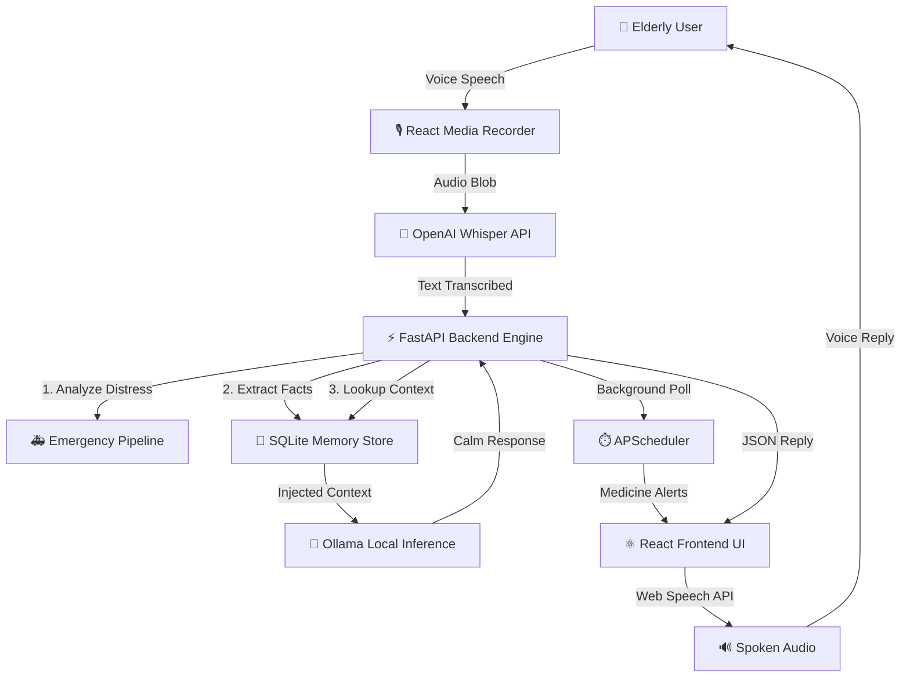
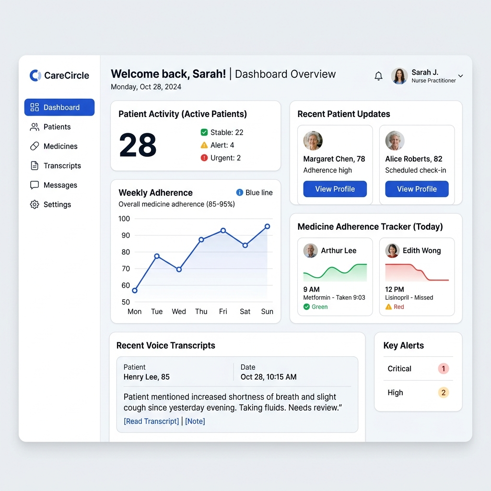
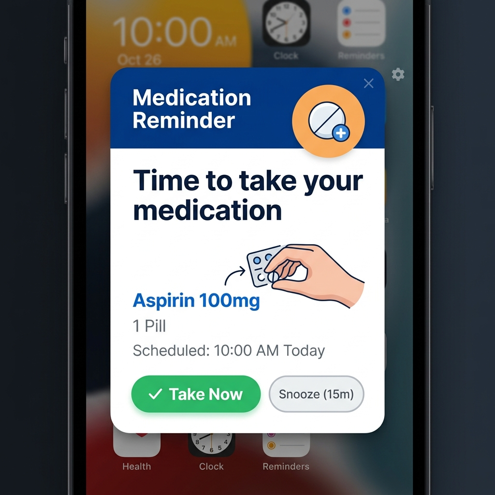

<div align="center">
  

  <br />
  <br />

  

  <h1>Orma AI – Memory Assistant for Elderly Care</h1>

  <p><b>A compassionate, real-time voice AI assistant designed specifically for elderly healthcare, memory tracking, and family monitoring.</b></p>

  [](https://fastapi.tiangolo.com/)
  [](https://reactjs.org/)
  [](https://www.python.org/)
  [](https://www.sqlite.org/)
  [](https://ollama.ai/)
</div>

<br/>

## 📖 Project Overview

**Orma AI** bridges the gap between complex digital interfaces and elderly accessibility by providing a completely **voice-first** experience. Built for seniors who struggle with screens, Orma AI passively listens, extracts important healthcare routines (like medicine schedules and appointments), and gently alerts them when action is needed. It operates as a continuous, empathetic companion that keeps families informed and elderly users safe. 

Designed to feel like a companion rather than a tool, Orma AI leverages state-of-the-art Natural Language Processing to make elderly care more humane and responsive.

## ✨ Key Features

- 🎙️ **Voice-First Interaction:** 100% hands-free conversational AI.
- 🧠 **Persistent Memory System:** Automatically learns routines, appointments, and medicine schedules from casual conversation.
- 🌍 **Native Multilingual Support:** Flawless English and highly contextual, casual regional languages (e.g., Kerala Malayalam) support.
- ⏰ **Real-Time Medicine Alerts:** Background cron-jobs ensure medicine is taken exactly on time.

- 🎨 **Accessibility-First UI:** Massive touch targets, high contrast, and smooth micro-animations tailored for visually impaired users.

---

## 🏗️ AI Architecture & Project Workflow

The core of Orma AI is its voice pipeline. User audio is captured via a custom React component, encoded, and sent to the FastAPI backend. There, **OpenAI's Whisper** handles high-fidelity transcription. The resulting text is routed through an intent-analyzer before hitting the **Ollama (Llama 3)** generation engine, ensuring responses are highly concise, strictly factual, and empathetic.



---

## 💻 Tech Stack & AI Project Branding

This repository is built as a production-ready AI application with a robust separation of concerns. 

### 🐍 Python Backend (FastAPI Engine)
- **Framework:** Python FastAPI (Uvicorn)
- **Task Scheduling:** APScheduler for persistent chron-jobs
- **Architecture:** Modular routes for wellness tracking, notifications, and AI generation

### ⚛️ React Frontend (Vite)
- **Framework:** React 18 (Vite)
- **Styling:** Tailwind CSS, Framer Motion
- **Capabilities:** `react-media-recorder`, Browser SpeechSynthesis API, WebSockets for real-time updates

### 🤖 AI/ML Components & APIs
- **Transcription:** OpenAI Whisper API (`medium` model) for real-time low-latency speech-to-text.
- **LLM Inference:** Local Ollama integration running `Llama-3` for privacy-first, on-device contextual generation.
- **Intent Recognition:** Custom prompt engineering for conversational context routing.

### 💾 Database
- **Primary Datastore:** SQLite + SQLAlchemy ORM (optimized for local edge-deployments).

### 🚀 Deployment Information
- **Dockerization:** Ready for containerized deployment.
- **Edge Deployment Target:** Designed to run on lightweight hardware (like a Raspberry Pi 4) for local, screen-less bedside smart speaker functionality.

---

## 🖼️ Screenshots

| Caregiver Dashboard (UI Preview) | Real-Time Medicine Alerts | Voice Interaction |
|:---:|:---:|:---:|
|  |  |  |

---

## 🚀 Installation Guide

### Prerequisites
- **Python 3.10+**
- **Node.js 18+**
- **Ollama:** Installed and running locally with the `llama3` model.

### 1. Clone the repository
```bash
git clone https://github.com/rzvn6660/orma-ai.git
cd orma-ai
```

### 2. Setup Backend Engine
The backend powers the AI logic, memory extraction, and medicine scheduling.
```bash
cd backend
python -m venv venv

# Activate Virtual Environment
# Windows:
venv\Scripts\activate
# Mac/Linux:
source venv/bin/activate

# Install dependencies
pip install -r requirements.txt

# Run the API
uvicorn main:app --reload
```
*API will run at `http://localhost:8000`*

### 3. Setup Frontend Client
The frontend provides the accessible, voice-first UI.
```bash
cd frontend
npm install
npm run dev
```
*App will launch at `http://localhost:5173`*


## OR
1. Start the Backend (Terminal 1)
Open a new terminal window, navigate to your project folder, activate the Python virtual environment, and start the FastAPI server:

powershell:
cd c:\Users\rizvi\orma-ai\backend
venv\Scripts\activate
uvicorn main:app --reload

The backend will now be running at http://localhost:8000.

2. Start the Frontend (Terminal 2)
Open a second, separate terminal window, navigate to the frontend folder, and start the React app:

powershell:
cd c:\Users\rizvi\orma-ai\frontend
npm run dev
---

## ⚙️ Usage Guide

1. **Launch Both Servers:** Ensure both FastAPI backend and React frontend are running.
2. **Interact:** Open the web app on a tablet or desktop. Press the large microphone button and speak a command (e.g., *"I have to take my blood pressure medicine every day at 8 AM"*).
3. **Memory Extraction:** Watch the backend terminal—it will extract the routine and save it to the local SQLite database.
4. **Trigger Alerts:** When the scheduled time hits, a loud, high-contrast modal will override the screen to alert the user.
5. **Caregiver Dashboard:** Log in to view mock data representations of adherence monitoring.

---

## 🛣️ Future Enhancements

- [ ] **Vector Database Integration:** Migrate from SQLite rule-based extraction to ChromaDB for infinite, semantic vector-based memory retrieval.
- [ ] **Real-Time Caregiver Dashboard:** Connect the UI preview dashboard to live backend WebSockets to monitor adherence and vital check-ins.
- [ ] **Emotional Wellness Analytics:** Add semantic sentiment analysis to track mood and confusion over time.
- [ ] **Emergency Detection System:** Real-time semantic monitoring for physical distress (e.g., "I fell down") using intent classification.
- [ ] **SMS Integration:** Connect Twilio to the Emergency Detection pipeline to automatically text family members if a crisis is detected.
- [ ] **IoT Hardware Build:** Port the React frontend to a Raspberry Pi setup, creating a standalone smart speaker.
- [ ] **Advanced Voice Cloning:** Replace the browser's Web Speech API with Piper TTS / Coqui TTS for emotionally-resonant voice models.

---

## 🤝 Contributing

Contributions are what make the open source community such an amazing place to learn, inspire, and create. Any contributions you make are **greatly appreciated**.

1. Fork the Project
2. Create your Feature Branch (`git checkout -b feature/AmazingFeature`)
3. Commit your Changes (`git commit -m 'Add some AmazingFeature'`)
4. Push to the Branch (`git push origin feature/AmazingFeature`)
5. Open a Pull Request

---

## 📄 License

Distributed under the MIT License. See `LICENSE` for more information.

---

## 📬 Contact

**Mohammed Rizvin MK** - [LinkedIn](https://www.linkedin.com/in/mohammed-rizvin-mk) - rizvinmk@gmail.com

Project Link: [https://github.com/rzvn6660/orma-ai](https://github.com/rzvn6660/orma-ai)

<div align="center">
  <br/>
  <p><i>Built with ❤️ to revolutionize eldercare and accessibility.</i></p>
</div>
