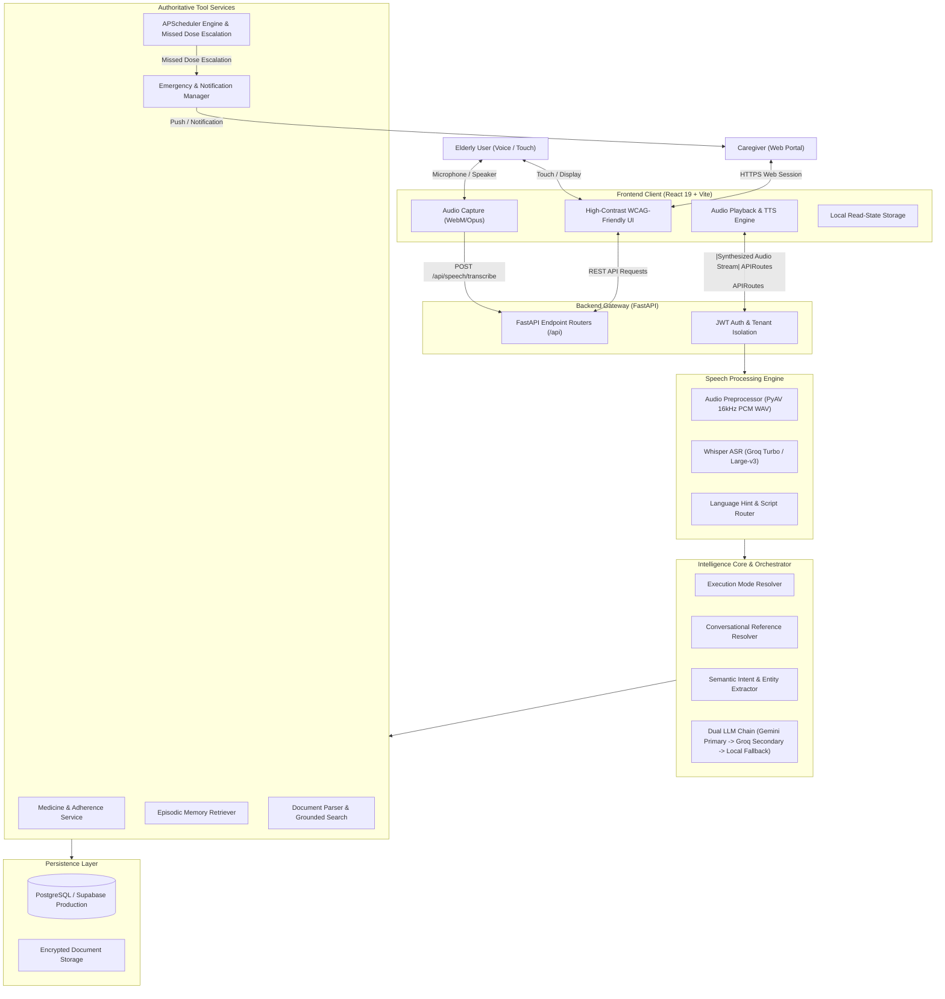

# ORMA AI

> **Voice-First AI Memory & Daily-Living Assistant for Older Adults and Caregivers**

[](https://github.com/rzvn6660/orma-ai/actions/workflows/ci.yml)
[](CHANGELOG.md)
[](https://app-orma-ai.onrender.com)
[](https://www.python.org/)
[](https://fastapi.tiangolo.com/)
[](https://react.dev/)
[](https://vitejs.dev/)
[](LICENSE)

- **Live Demo**: [https://app-orma-ai.onrender.com](https://app-orma-ai.onrender.com)
- **Backend API**: [https://orma-ai.onrender.com](https://orma-ai.onrender.com)
- **Interactive API Docs**: [https://orma-ai.onrender.com/docs](https://orma-ai.onrender.com/docs)

---

## Overview

As individuals age, managing daily routines, remembering complex medication schedules, and navigating smartphone user interfaces can introduce significant cognitive fatigue. Traditional healthcare apps rely heavily on small touch targets, multi-step navigation menus, and manual text inputs that often create barriers for elderly users. At the same time, family members and caregivers need dependable visibility into daily adherence without eroding the older adult's independence.

**ORMA AI** is engineered as a voice-first healthcare companion that bridges natural human dialogue with deterministic medical safety. Older adults can simply speak naturally—inquiring about upcoming medicines, confirming intake through conversational phrases (*"I took it"*), recalling personal memories, or triggering life-safety assistance. Behind the conversation layer, an authoritative backend maintains schedule integrity, coordinates multi-turn context, and escalates missed doses to linked caregivers.

---

## Key Features

- **Voice Conversation**: Hands-free, low-latency audio interaction supporting both push-to-talk and conversational modes.
- **English-First Production Voice Pipeline**: Validated end-to-end voice transcription, intent parsing, and natural speech synthesis.
- **Beta Multilingual Voice Support**: Beta voice recognition and response generation for Malayalam, Tamil, Hindi, and Manglish with automated script detection and phonetic recovery heuristics.
- **Medication Reminders**: Timezone-aware daily, weekly, and interval scheduling with minute-by-minute automated evaluation.
- **Medication Adherence Confirmation**: Supports both natural voice confirmations (*"I already took my morning pill"*, *"I took it"*) and direct UI actions.
- **Conversational Context & Pronoun Resolution**: Multi-turn reference resolver that identifies pronouns and contextual references (*"it"*, *"that medicine"*) from recent dialogue history.
- **AI Memory (OCME)**: Context-aware personal memory extraction and grounded recall that safely stores and retrieves personal facts and preferences.
- **Deterministic Emergency Support**: Safety-critical phrases (*"Help me"*, *"I fell down"*, *"Call my caregiver"*) bypass LLM inference latency to trigger immediate alerts and reassuring responses.
- **Caregiver Dashboard & Linking**: Role-based access control with secure pairing codes and authorization workflows.
- **Caregiver Notifications & Escalation**: In-app alerts, browser notifications, and automated escalation when a critical dose remains unconfirmed past the 30-minute threshold.
- **Medical Document Storage & RAG**: Secure document ingestion for prescriptions and discharge summaries with text extraction and grounded question-answering.
- **Speech-to-Text (ASR) & Text-to-Speech (TTS)**: Built-in audio preprocessing pipeline (WebM/Opus decoding to normalized 16 kHz 16-bit mono PCM WAV) paired with Whisper ASR and multilingual TTS synthesis.

---

## Architecture

The diagram below illustrates the end-to-end flow from user audio to authoritative service execution:



---

## Technology Stack

| Component | Technologies |
|---|---|
| **Backend API** | Python 3.11+, FastAPI, Uvicorn, Pydantic v2 |
| **Database & ORM** | PostgreSQL (Supabase) in production, SQLite 3 (WAL mode) fallback, SQLAlchemy 2.0 |
| **Frontend Application** | React 19, Vite 8, Tailwind CSS, Lucide Icons |
| **Speech Processing & ASR** | Groq Whisper (`whisper-large-v3-turbo`), PyAV (`av`), NumPy, SciPy, Python `wave` |
| **AI & LLM Providers** | Google Gemini (Primary), Groq / LLaMA (Secondary / Failover), Rule-based Fallback |
| **Document Processing** | PyMuPDF (`fitz`), Tesseract-OCR (`pytesseract`) |
| **Job Scheduling** | APScheduler (automated interval evaluation & escalation) |
| **Containerization & CI** | Docker, GitHub Actions CI Pipeline |
| **Hosting Platform** | Render (Dockerized Web Service + Static Site) |

---

## Voice & Multilingual Support

ORMA AI employs an adaptive speech pipeline designed to handle varying acoustic conditions:

### Production Priority
- **English**: Fully validated end-to-end voice transcription, intent parsing, medication confirmations, and voice synthesis. Recommended for primary production use.

### Beta Languages
- **Malayalam** (`ml`): Beta voice transcription with script normalization and phonetic recovery heuristics.
- **Tamil** (`ta`): Beta voice transcription and regional TTS synthesis.
- **Hindi** (`hi`): Beta voice transcription and conversational handling.
- **Manglish**: Beta support for English-Malayalam code-switched phrases.

> **Engineering Note**: Multilingual speech recognition accuracy is actively being optimized. Performance can vary based on microphone proximity, background acoustic noise, regional dialects, and utterance duration. Single-word utterances (such as isolated affirmations) present higher acoustic ambiguity than full sentences. Systematic benchmark results are continuously gathered to improve model selection and prompt conditioning.

---

## Safety, Privacy & Medical Disclaimers

### Implemented Security Measures
- **Tenant Data Isolation**: Database queries, document vectors, and memory extractions strictly enforce `user_id == current_user.id` or require an active, approved caregiver relationship.
- **Deterministic Medical Guardrails**: The conversational brain enforces strict prompt safety constraints:
  > *"Never claim that a user has taken a medicine unless the database context explicitly states it is confirmed/taken."*
- **Emergency Keyword Precedence**: Life-safety keywords immediately trigger emergency alert protocols and bypass generative LLM latency.
- **Credential & Secret Isolation**: API keys (`GEMINI_API_KEY`, `GROQ_API_KEY`, `JWT_SECRET_KEY`) reside exclusively in backend server environments and are never exposed in frontend bundles or client logs.

### Medical Disclaimer
> **IMPORTANT**: ORMA AI is an assistive technology prototype designed for memory support, routine tracking, and caregiver communication. It is **not a certified medical device** and does not provide clinical diagnoses, medical advice, prescription adjustments, or emergency medical services. ORMA AI must never replace professional healthcare consultations, physician advice, or human caregiver supervision. In acute medical emergencies, immediately contact local emergency services.

---

## Deployment

The production release is hosted on Render across two dedicated services:

- **Frontend Web Application**: [https://app-orma-ai.onrender.com](https://app-orma-ai.onrender.com)
- **Backend Core API**: [https://orma-ai.onrender.com](https://orma-ai.onrender.com)
- **Interactive OpenAPI Documentation**: [https://orma-ai.onrender.com/docs](https://orma-ai.onrender.com/docs)

### Continuous Integration
Every push to the `main` branch is automatically validated by the GitHub Actions CI pipeline:
- **Backend Test Suite**: Executes 397 regression, unit, intelligence, voice, and RAG tests.
- **Frontend Verification**: Runs ESLint checks and compiles the production Vite bundle before deployment.

---

## Testing & Quality Assurance

ORMA AI maintains a comprehensive automated testing suite:

| Test Layer | Scope | Tests | CI Status |
|---|---|---|---|
| **Voice & ASR Pipeline** | Audio decoding, silence trimming, loudness normalization, WAV writing | 22 tests | **PASS** |
| **Intelligence & LLM Routing** | Mode resolution, intent classification, multi-turn followups, fallback | 145 tests | **PASS** |
| **Medication & Scheduler** | Date-scoping, timezone handling, adherence marking, midnight escalation | 68 tests | **PASS** |
| **Authentication & RBAC** | JWT validation, password hashing, caregiver link approvals | 72 tests | **PASS** |
| **Document RAG & Memory** | OCR extraction, chunking, tenant isolation, memory recall | 54 tests | **PASS** |
| **Full Integration Gate** | End-to-end release validation, API contracts, notification delivery | 36 tests | **PASS** |
| **Total Automated Suite** | Complete backend test surface | **397 tests** | **PASS (100%)** |
| **Frontend Code Quality** | ESLint static analysis | 0 errors / 0 warnings | **PASS** |
| **Frontend Production Build** | Vite production compilation & minification | Clean bundle | **PASS** |

All 397 backend tests passed in GitHub Actions CI workflow run #20 for release commit `0b6f4df`.

To run the test suites locally:

```bash
# Run backend pytest suite
pytest backend/tests/ -q

# Run frontend lint and build
cd frontend
npm run lint
npm run build
```

---

## Current Release

### v0.1.0-beta.1
**Status**: Live Beta (Deployed to Production)

**Release Highlights**:
- **Production Voice Pipeline**: English voice interaction with WebM/Opus client recording and server-side Whisper processing.
- **Multilingual Beta**: Initial voice routing for Malayalam, Tamil, Hindi, and Manglish.
- **Reliable Scheduler Engine**: Timezone-aware medication scheduler featuring 30-minute escalation and a 24-hour recency window that safely accommodates midnight boundary crossings.
- **Conversational Adherence**: Contextual understanding of affirmations (*"I took it"*) with pronoun reference resolution.
- **Caregiver Hub**: Linking elderly and caregiver profiles with notification telemetry.
- **Zero External Audio Dependencies**: Standardized on Python's built-in `wave` module and PyAV for cross-platform container portability.
- **Automated CI Validation**: 397 passing tests in continuous integration.

---

## Known Limitations

- **Multilingual Voice in Beta**: Non-English speech recognition (Malayalam, Tamil, Hindi) is in Beta. Short, single-word phrases may experience lower accuracy compared to full-sentence utterances.
- **Acoustic Dependency**: Speech transcription depends on ambient noise levels, microphone hardware quality, and clear speech cadence.
- **Cloud Free-Tier Cold Starts**: On free-tier hosting environments, backend instances may take a few seconds to spin up if idle.
- **Not Medical Care**: As stated in the disclaimer, ORMA AI assists with daily routines and memory support; it does not diagnose or manage medical conditions.

---

## Roadmap

- [ ] **Multilingual ASR Robustness**: Ongoing dataset benchmarking and prompt tuning for dialect-specific accuracy.
- [ ] **Elderly-Friendly Audio UX**: Enhanced silence padding, pause tolerance, and configurable TTS speech rates.
- [ ] **Advanced Caregiver Workflows**: Weekly adherence analytics summaries and multi-channel SMS/WhatsApp alerts.
- [ ] **Real-Time Streaming**: Exploration of WebSocket bidirectional audio streaming for ultra-low-latency voice turns.
- [ ] **Mobile App Package**: Progressive Web App (PWA) offline caching and native container wrappers.
- [ ] **Progression to v1.0**: Hardening all Beta features toward general availability.

---

## Contributing

Contributions, issue reports, and suggestions are welcome!

1. Fork the repository.
2. Create your feature branch (`git checkout -b feature/amazing-feature`).
3. Ensure all tests pass (`pytest backend/tests/` and `npm run lint`).
4. Commit your changes (`git commit -m 'feat: add amazing feature'`).
5. Push to the branch (`git push origin feature/amazing-feature`).
6. Open a Pull Request.

---

## License

This project is licensed under the MIT License — see the [LICENSE](LICENSE) file for details.
