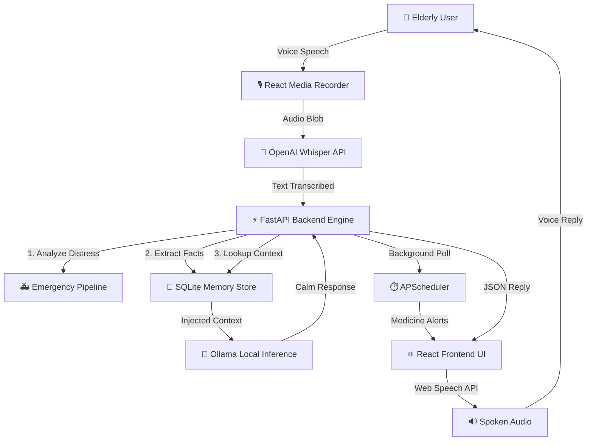

<div align="center">
  
  
  <h1>Orma AI — AI Memory Assistant for Elderly Care</h1>
  
  <p><b>A compassionate, real-time voice AI assistant designed specifically for elderly healthcare, memory tracking, and family monitoring.</b></p>

  [](https://fastapi.tiangolo.com/)
  [](https://reactjs.org/)
  [](https://www.python.org/)
  [](https://www.sqlite.org/)
  [](https://ollama.ai/)
</div>

<br/>

## 1. Project Overview
**Orma AI** bridges the gap between complex digital interfaces and elderly accessibility by providing a completely **voice-first** experience. Built for seniors who struggle with screens, Orma AI passively listens, extracts important healthcare routines (like medicine schedules and appointments), and gently alerts them when action is needed. It operates as a continuous, empathetic companion that keeps families informed and elderly users safe.

## 2. Features
- 🎙️ **Voice-First Interaction:** 100% hands-free conversational AI.
- 🧠 **Persistent Memory System:** Automatically learns routines, appointments, and medicine schedules from casual conversation.
- 🌍 **Native Multilingual Support:** Flawless English and highly contextual, casual Kerala Malayalam support.
- ⏰ **Real-Time Medicine Alerts:** Background chron-jobs ensure medicine is taken on time.
- 🚑 **Emergency Detection System:** Real-time semantic monitoring for physical distress (e.g., "I fell down", "chest pain").
- 🎨 **Accessibility-First UI:** Massive touch targets, high contrast, and smooth micro-animations.

---

## 3. AI Architecture



---

## 4. Tech Stack

### Frontend Client
- **Framework:** React (Vite)
- **Styling:** Tailwind CSS, Framer Motion
- **Voice Capabilities:** `react-media-recorder`, Browser SpeechSynthesis API
- **State Management:** Custom React Hooks

### Backend Engine
- **Framework:** Python FastAPI (Uvicorn)
- **Database:** SQLite + SQLAlchemy ORM
- **Task Scheduling:** APScheduler
- **AI Models:** OpenAI Whisper (`medium`), Ollama (Llama 3)

---

## 5. Screenshots Section

*(Replace placeholders with actual UI screenshots before launch)*

| Dashboard Overview | Real-Time Medicine Alerts | Emergency Detection Active |
|:---:|:---:|:---:|
|  |  |  |

---

## 6. Installation Guide

### Prerequisites
- **Python 3.10+**
- **Node.js 18+**
- **Ollama:** Installed and running locally with the `llama3` model.

Clone the repository:
```bash
git clone https://github.com/yourusername/orma-ai.git
cd orma-ai
```

---

## 7. Running Backend

The backend powers the AI logic, memory extraction, and medicine scheduling.

```bash
cd backend
python -m venv venv

# Activate Virtual Environment
# Windows:
venv\Scripts\activate
# Mac/Linux:
source venv/bin/activate

pip install -r requirements.txt
uvicorn main:app --reload
```
*API will run at `http://localhost:8000`*

---

## 8. Running Frontend

The frontend provides the accessible, voice-first UI.

```bash
cd frontend
npm install
npm run dev
```
*App will launch at `http://localhost:5173`*

---

## 9. Voice AI Pipeline
The core of Orma AI is its voice pipeline. User audio is captured via a custom `VoiceRecorder` component, encoded, and sent to the FastAPI backend. There, **OpenAI's Whisper (`medium`)** handles high-fidelity transcription. The resulting text is routed through an intent-analyzer before hitting the **Ollama (Llama 3)** generation engine, ensuring responses are highly concise, strictly factual, and empathetic.

## 10. Medicine Memory System
Unlike standard chatbots, Orma possesses persistent episodic memory. Built heavily on **SQLAlchemy**, the AI passively scans conversations. If an elderly user mentions an appointment or medicine, the rule-based extraction engine silently stores it. A background **APScheduler** runs every 15 seconds, polling the SQLite database and pushing real-time, screen-overriding popups to the frontend when a dose is due.

## 11. Malayalam Support
Recognizing that elderly users often prefer their mother tongue, Orma features deep regional support. By bypassing generic translation layers, the system explicitly forces Whisper into Malayalam (`ml`) mode when toggled. The AI system prompt is heavily strictly engineered to reply in **casual, conversational Kerala Malayalam**—avoiding robotic, dictionary-style translations that confuse seniors. 

## 12. Emergency Detection
Safety is paramount. The backend runs an aggressive semantic check on all transcribed audio *before* generating an AI response. If distress keywords ("fell down", "chest pain", "can't breathe") are detected, the standard AI loop is suspended. The frontend instantly shifts into an **Emergency State** (pulsing red UI, severe audio alerts), preparing the pipeline for future automated SMS dispatch to family members.

---

## 13. Future Roadmap

- [ ] **Vector Database Integration:** Migrate from SQLite rule-based extraction to ChromaDB for infinite, semantic vector-based memory retrieval.
- [ ] **Family Monitoring Web Portal:** Launch a remote dashboard allowing children to monitor their parent's medicine adherence and vital check-ins.
- [ ] **SMS Integration:** Connect Twilio to the Emergency Detection pipeline to automatically text family members if a crisis is detected.
- [ ] **IoT Hardware Build:** Port the React frontend to a Raspberry Pi Zero setup, creating a standalone, screen-less bedside smart speaker.
- [ ] **Advanced Voice Cloning:** Replace the browser's Web Speech API with Piper TTS / Coqui TTS for hyper-realistic, emotionally-resonant voice models.

<div align="center">
  <br/>
  <p><i>Built with ❤️ to revolutionize eldercare and accessibility.</i></p>
</div>
