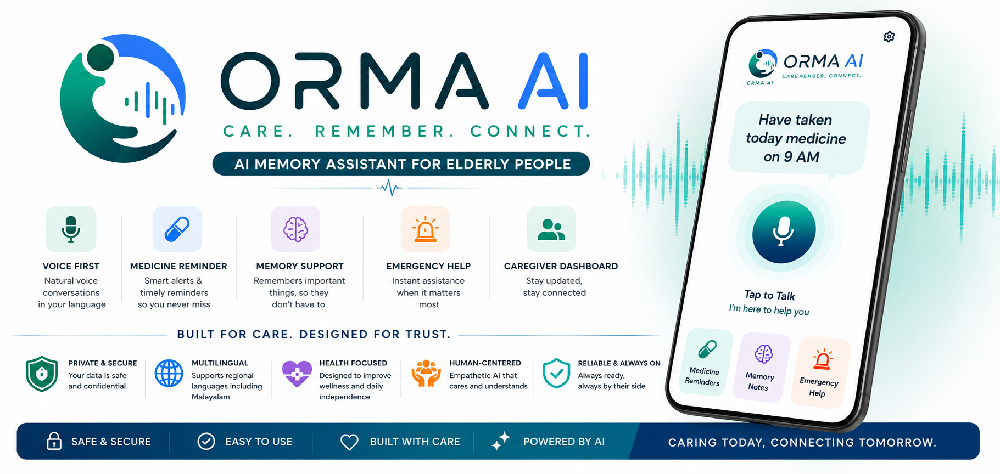

> **ORMA AI — AI-powered care, memory, reminders, and family connection for older adults.**

- **Live Demo**: [https://app-orma-ai.onrender.com](https://app-orma-ai.onrender.com)
- **Backend API**: [https://orma-ai.onrender.com](https://orma-ai.onrender.com)
- **Interactive API Docs**: [https://orma-ai.onrender.com/docs](https://orma-ai.onrender.com/docs)

---

## What is ORMA AI?

As individuals age, managing daily routines, complex medication schedules, and navigating smartphone UI interfaces can introduce cognitive fatigue. Traditional healthcare apps rely on small touch targets and complex navigation that create barriers for elderly users, while caregivers need dependable visibility without eroding the older adult's independence.

ORMA AI is a voice-first healthcare companion that bridges natural human dialogue with deterministic medical safety. Older adults can speak naturally—inquiring about medicines, confirming intake, recalling personal memories, or triggering life-safety assistance. An authoritative backend maintains schedule integrity, context, and escalates critical missed events to linked caregivers.

---

## Key Capabilities

- **Voice-First Interaction**: Hands-free, low-latency audio interaction supporting natural conversational queries.
- **Medication Reminders and Adherence**: Timezone-aware scheduling with adherence tracking via voice confirmations (*"I took it"*) or direct UI actions.
- **AI Memory Assistance (OCME)**: Context-aware personal memory extraction and grounded recall that safely retrieves personal facts and preferences.
- **Emergency Support**: Deterministic keyword detection (*"Help me"*) bypasses generative latency to immediately trigger emergency alerts.
- **Multilingual Voice Support (Beta)**: Beta recognition and response generation for languages like Malayalam, Tamil, Hindi, and Arabic with Right-to-Left (RTL) interface adaptation.
- **Caregiver & Family Connection**: Role-based access control linking elderly profiles with trusted caregivers for routine visibility and alerts.
- **Notifications**: Automated escalation when critical medication remains unconfirmed past the safe threshold.
- **Authentication & Account Security**: Secure email verification using the Gmail API, password resets, and complete data isolation.
- **RAG/Document Support**: Secure ingestion of medical documents with text extraction and grounded question-answering.

---

## System Architecture

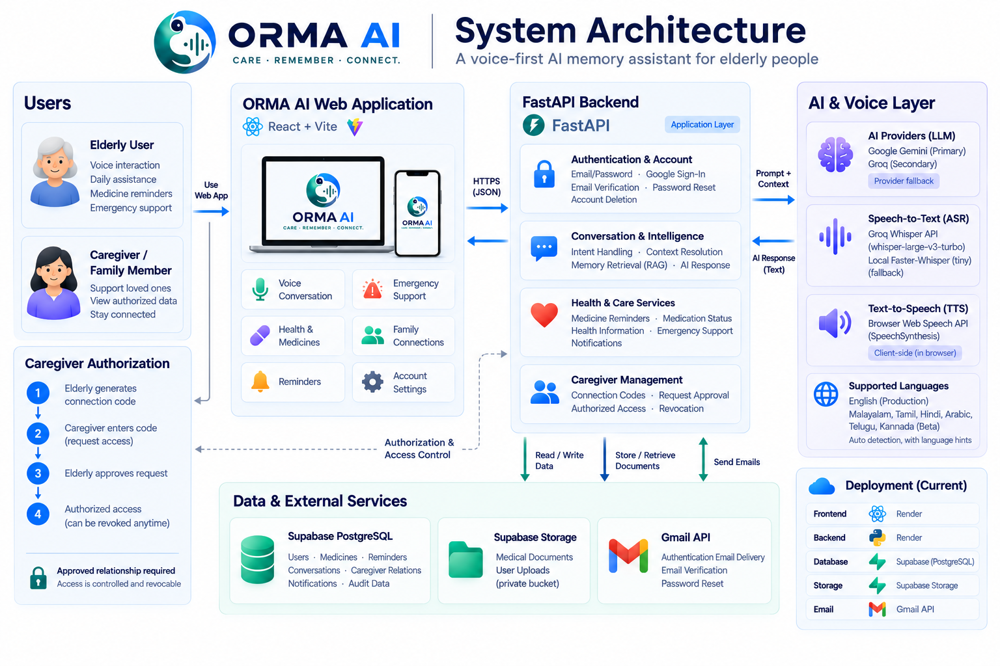

The system operates via a decoupled frontend and backend:
1. **Frontend**: The React application captures voice or touch inputs. Audio is captured and sent securely to the backend API.
2. **Speech Pipeline**: An audio preprocessor handles formatting before utilizing Whisper ASR for accurate transcription, with routing for specific dialects.
3. **Intelligence Core**: A conversational orchestrator evaluates the transcript against recent history, determining whether it is a medical query, memory recall, or emergency.
4. **Authoritative Services**: Modifies adherence records, escalates notifications via background schedulers, or queries isolated RAG/memory stores.
5. **Response & TTS**: The backend returns a text response, and the browser-side SpeechSynthesis API handles Text-to-Speech audio generation locally.
6. **Persistence**: State is strictly maintained in PostgreSQL (Supabase) using zero-trust tenant isolation to ensure no cross-contamination of patient data.

---

## Technology Stack

- **Backend API**: Python 3.11+, FastAPI, Uvicorn
- **Database & ORM**: PostgreSQL (Supabase session pooler), SQLAlchemy 2.0 (fallback to SQLite 3 WAL mode)
- **Frontend Application**: React 19, Vite 8, Tailwind CSS, Lucide Icons
- **Speech Processing & ASR**: Groq Whisper (`whisper-large-v3-turbo`) with local Faster-Whisper (tiny) fallback, PyAV (`av`), NumPy, SciPy
- **Text-to-Speech**: Browser Web Speech API (SpeechSynthesis), client-side
- **AI & LLM Providers**: Google Gemini (Primary), Groq (Secondary / Failover)
- **Document Processing**: PyMuPDF (`fitz`), Tesseract-OCR (`pytesseract`)
- **Job Scheduling**: APScheduler (interval evaluation & missed dose escalation)
- **Hosting Platform**: Render (Web Service + Static Site)

---

## Voice & AI

ORMA AI employs an adaptive speech pipeline designed to handle varying acoustic conditions:

- **Production English**: Fully validated end-to-end voice transcription, intent parsing, medication confirmations, and voice synthesis.
- **Multilingual Beta**: Transcription and language handling for Malayalam (`ml-IN`), Tamil (`ta-IN`), Hindi (`hi-IN`), Arabic (`ar-SA`), and Manglish. Features automated language detection and script normalization heuristics.

*Note: Non-English speech recognition accuracy is actively being optimized. Performance can vary based on noise levels, dialects, and single-word utterance ambiguity.*

---

## Caregiver & Family Connection

ORMA AI enables secure, consented data sharing between elderly users and trusted caregivers:

1. **Elderly User**: Navigates to **Settings → Family Connections** and clicks **Generate Connection Code**. A secure, expiring code is generated.
2. **Caregiver**: Navigates to their **Settings → Family Connections** and enters the generated code.
3. **Elderly User**: Reviews the pending request in their dashboard and clicks **Approve**.
4. **Connected State**: The caregiver is now authorized to view permitted care information. The elderly user maintains full control and can revoke access at any time.

---

## Authentication & Account Security

ORMA AI uses a robust authentication flow built directly into the application:
- **Sign Up**: Provides immediate dashboard access upon registration.
- **Email Verification**: Verification (using the Gmail API for delivery) can be completed post-login.
- **Password Reset**: Secure reset flows using time-bound OTPs.
- **Account Deletion**: Authenticated account deletion instantly scrubs personal data and cleans up active caregiver relationships.
- **Data Isolation**: Strict multi-tenant isolation ensures database queries and vector retrievals are exclusively bound to `user_id == current_user.id` or authorized caregiver links.

---

## Product Experience

ORMA is designed around a simple interaction: speak naturally → ORMA understands → ORMA responds or takes action.

### Product Overview
ORMA provides a focused, accessible interface designed specifically for elderly users to manage their daily care.

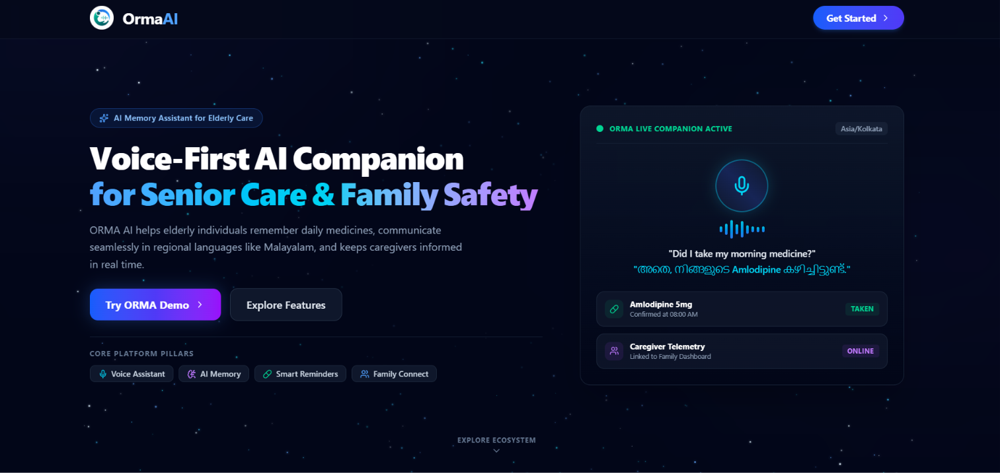

### Secure Access
A polished and secure entry experience utilizing email verification and password authentication.

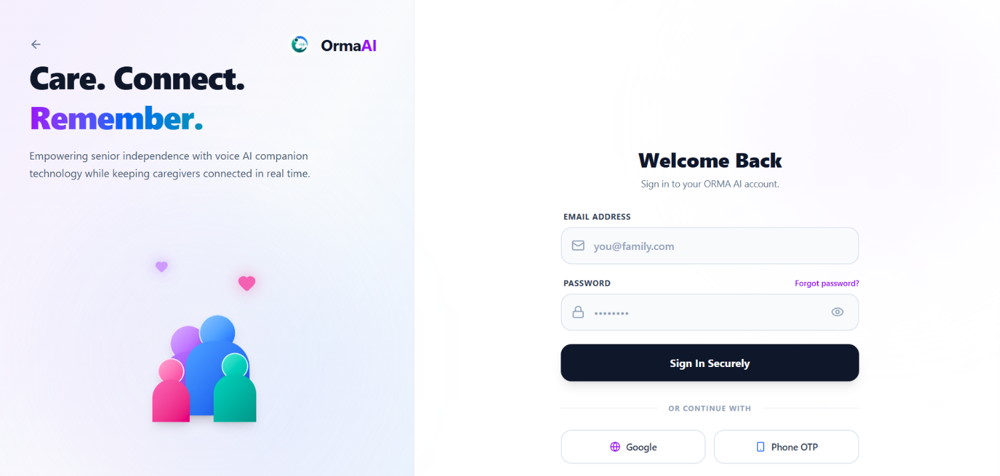

### 1. Talk Naturally
Users can interact with ORMA through hands-free voice and conversational input. The system seamlessly transcribes queries and returns useful, contextual responses.

  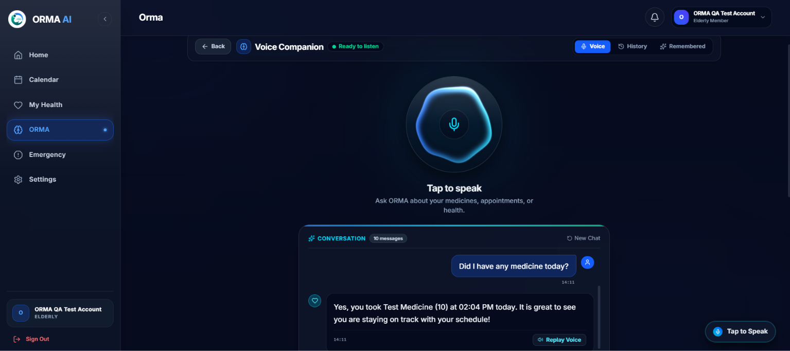
  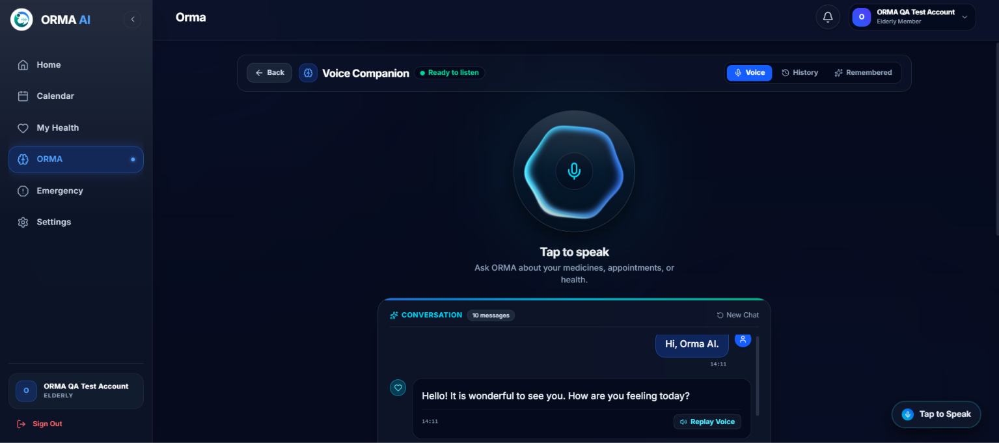

### 2. Manage Daily Health
The dedicated health workspace fits perfectly into the user's daily routine, providing an organized view of their active medicines and schedules.

  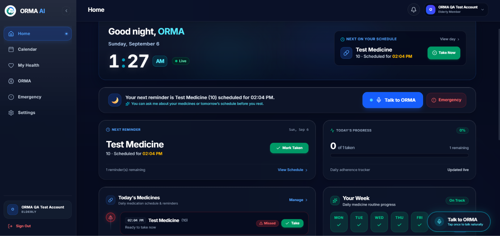
  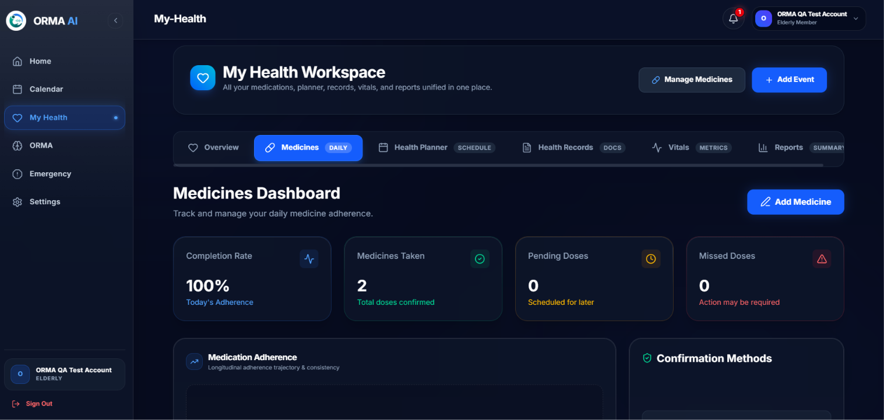

### 3. Stay on Track
The system provides a clear reminder and medication confirmation experience to help users adhere to their prescribed schedules.

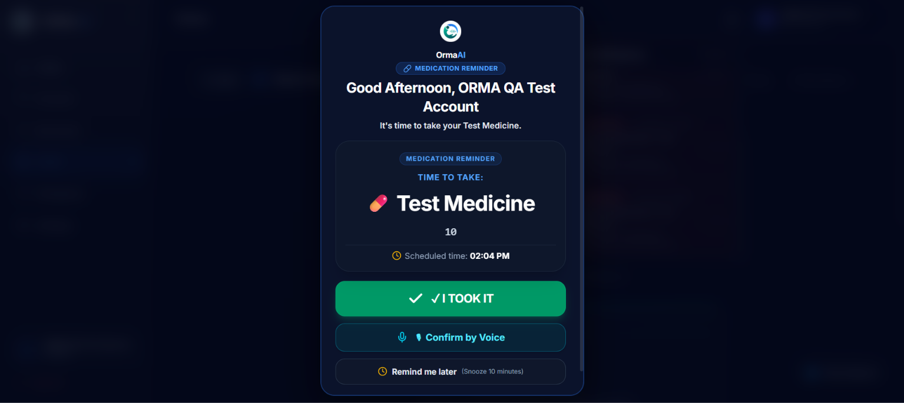

### 4. Safety & Emergency Support
ORMA provides a dedicated emergency-support area configured with trusted contact information and rapid-access actions.

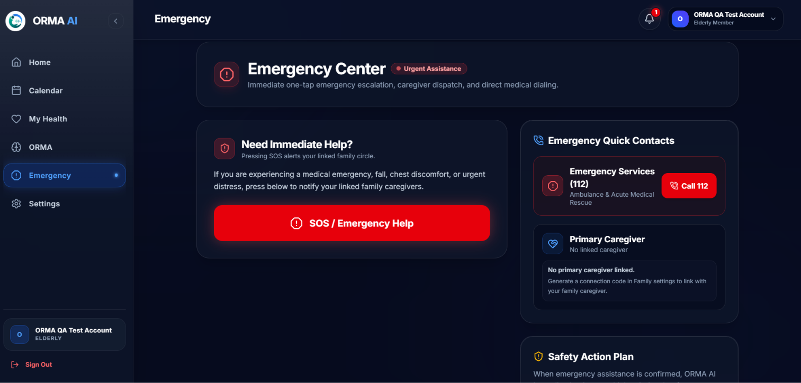

### 5. Caregiver Connection
The caregiver flow is simple and secure: the elderly user generates a secure connection code → the caregiver enters the code → the elderly user approves the request → caregiver access becomes authorized.

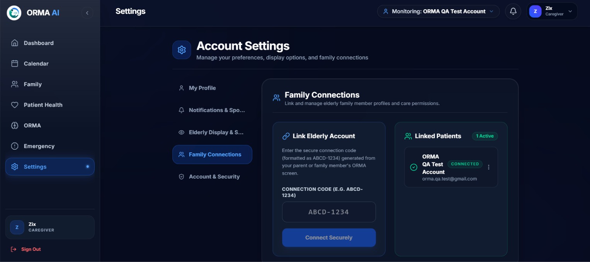

### Mobile Entry Experience
The mobile entry experience carries the ORMA visual language securely across phone and tablet form factors.

  
  

### Mobile ORMA Experience
The core application experience adapts seamlessly across mobile and tablet interfaces, preserving accessibility and ease of use.

  

---

## Deployment

The production release is hosted on **Render**:
- **Frontend Web Application**: Deployed as a static React/Vite site.
- **Backend Core API**: Deployed as a containerized Python FastAPI web service backed by a Supabase PostgreSQL instance.

---

## Testing & Quality

ORMA AI maintains a comprehensive suite of verifications:

- **Automated Backend Tests**: 422 tests executing across voice pipelines, LLM intelligence, scheduling, auth, and integration boundaries.
  - *Current Status*: 421 tests passing successfully. (1 known limitation related to UTC/Local timezone boundary alignment during mock evaluations).
- **Frontend Verification**: Clean `npm run lint` validation with 0 errors/warnings. Clean Vite production build execution.
- **Production Guardrails**: Strict session connection pools, startup JWT secret validations, and fallback environments.

---

## Privacy, Security & Medical Disclaimer

**IMPORTANT**: ORMA AI is an assistive technology prototype designed for memory support, routine tracking, and caregiver communication. It is **not a certified medical device** and does not provide clinical diagnoses, medical advice, prescription adjustments, or emergency medical services.

ORMA AI must never replace professional healthcare consultations, physician advice, or human caregiver supervision. In acute medical emergencies, immediately contact local emergency services.

---

## Current Release

### v0.1.0-beta.1
**Status**: Live Beta (Deployed to Production)

**Highlights**:
- Production English voice pipeline with Whisper ASR and Gemini intent processing.
- Completed elderly-to-caregiver Family Connections approval flow.
- Minimal-footprint PostgreSQL connection pooling for Render scaling.
- Verified Gmail API integration for critical email deliveries.

---

## Limitations & Roadmap

### Known Limitations
- **Multilingual Voice in Beta**: Non-English speech recognition is in Beta. Short, single-word phrases may experience lower accuracy compared to full-sentence utterances.
- **Hardware Dependency**: Transcription accuracy depends on microphone quality and ambient noise.
- **Render Cold Starts**: On free-tier environments, the backend may take a few seconds to wake from idle.

### Roadmap
- **Multilingual ASR Robustness**: Ongoing dataset benchmarking for dialect-specific accuracy.
- **Advanced Caregiver Analytics**: Weekly adherence summaries and detailed trend reports.
- **Real-Time Streaming**: Exploration of WebSocket bidirectional audio streaming for ultra-low latency.

---

## Contributing

Contributions, issue reports, and suggestions are welcome!
1. Fork the repository.
2. Create your feature branch (`git checkout -b feature/amazing-feature`).
3. Ensure all tests pass (`pytest backend/tests/` and `npm run lint`).
4. Commit your changes (`git commit -m 'feat: add amazing feature'`).
5. Push to the branch (`git push origin feature/amazing-feature`).
6. Open a Pull Request.

---

## License

This project is licensed under the MIT License — see the [LICENSE](LICENSE) file for details.
