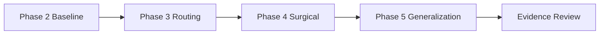
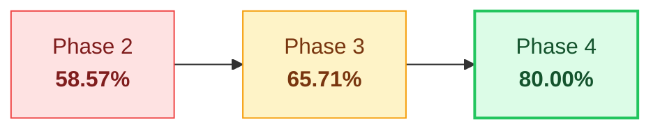
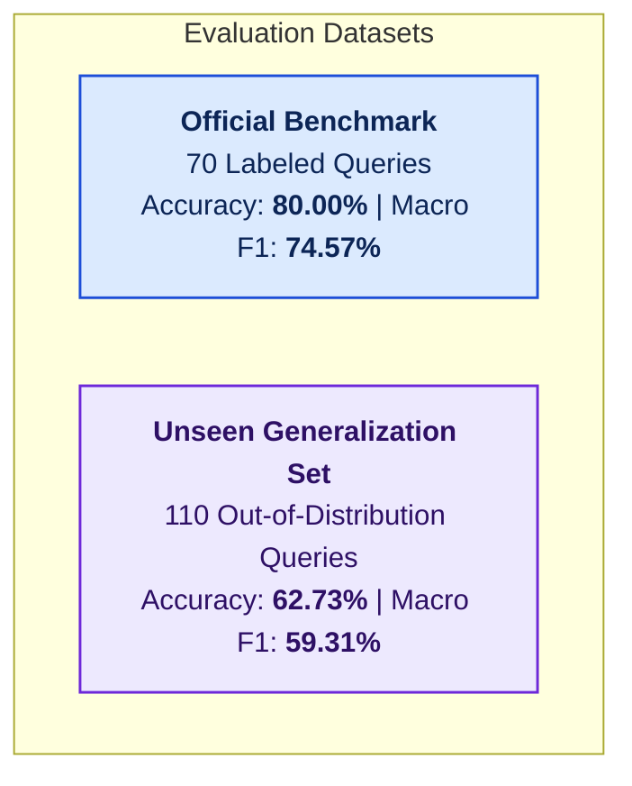

<div align="center">

# ORMA_AI

**Voice-first AI memory and daily-living assistant designed for older adults and their caregivers.**

[](https://github.com/rzvn6660/orma-ai/actions/workflows/ci.yml)
[](CHANGELOG.md)
[](https://www.python.org/)
[](https://fastapi.tiangolo.com/)
[](https://react.dev/)
[](https://tailwindcss.com/)
[](LICENSE)

[Live Demo](https://app-orma-ai.onrender.com) • [Backend API](https://orma-ai.onrender.com) • [API Documentation](https://orma-ai.onrender.com/docs) • [System Architecture](docs/architecture.md)

</div>

---


---

## Project Overview Video

The video walkthrough covers the problem ORMA_AI addresses, how the voice companion interacts with older adults, and how the underlying architecture handles memory, medication safety, and caregiver escalation.

https://github.com/user-attachments/assets/3b10af6c-2fa7-4205-8ab2-df2a11f30448

---

## Executive Overview

| Dimension | Description |
| :--- | :--- |
| **What It Is** | An assistive, voice-first AI memory and daily-living companion prototype for older adults. |
| **Who It Is For** | Aging seniors managing daily routines and medications, and designated family caregivers needing peace of mind. |
| **The Real-World Problem** | Small fonts, complex nested menus, multi-dose medication regimens, cognitive fatigue, and language barriers cause friction, missed doses, and safety risks for seniors. |
| **Why Technically Interesting** | Not an LLM wrapper: combines an audio preprocessing pipeline, multilingual Whisper ASR, deterministic intent and safety routing paths designed to avoid unnecessary LLM calls (Phase 4 measured 169.1 ms median orchestration latency across 25 benchmark runs), an entity-extracting memory engine (OCME), grounded medical document RAG, and dual-LLM automated failover. |
| **Where to See It Working** | **[Live Web Application](https://app-orma-ai.onrender.com)** • **[Interactive API Docs](https://orma-ai.onrender.com/docs)** • **[Video Walkthrough](#project-overview-video)** |

---

## Beta 1 at a Glance

A concise summary of verified system capabilities in ORMA_AI `v0.1.0-beta.1`:

* **Voice-First Interaction**: Hands-free spoken dialogue with browser audio capture, automated gain/silence preprocessing, and client-side synthesized speech playback.
* **Multilingual Speech (Beta)**: Speech recognition, script normalization, and conversational interaction for Malayalam (`ml-IN`), Tamil (`ta-IN`), Hindi (`hi-IN`), Arabic (`ar-SA`, with dynamic RTL UI adaptation), and English.
* **Medication Assistance**: Timezone-aware scheduling, dose confirmation via natural speech (*"I took my morning pills"*) or high-contrast touch controls, and missed-dose escalation.
* **Memory Engine (OCME)**: Context-aware Older Care Memory Engine that securely extracts, stores, and recalls personal facts, preferences, and daily routines without prompt token bloat.
* **Personal Document RAG**: Secure extraction and grounded retrieval of medical discharge summaries, prescriptions, and lab notes using `PyMuPDF` and `Tesseract OCR` with strict tenant isolation.
* **Emergency Safety Routing**: Life-safety keywords (*"Help me"*, *"Call doctor"*, *"I fell"*) completely bypass generative LLM reasoning to invoke immediate deterministic caregiver alerts.
* **Caregiver Support**: Role-based access control pairing senior accounts with family caregivers via expiring pairing codes (8-character alphanumeric format: XXXX-0000), providing adherence telemetry and notifications.
* **Multi-Tenant Security**: Per-user database isolation, database-backed rate limiting per IP and action, Bcrypt password hashing, expiring signed JWTs, and secure Gmail API email verification.
* **Automated Testing & CI**: 451 backend tests passing in the latest regression run and frontend static analysis running on GitHub Actions.

---

## Why ORMA_AI?

As individuals age, managing daily routines, remembering complex medication regimens, and navigating modern touchscreens with small fonts and multi-step menus introduces substantial cognitive strain and physical friction. Older adults often experience:

* **Cognitive and Memory Fatigue**: Difficulty keeping track of multi-dose daily medications, past medical events, and daily appointments.
* **Digital Literacy & Accessibility Barriers**: Traditional smartphone interfaces rely on dense menus, nested settings, and low-contrast controls that alienate users with tremor or visual impairments.
* **Language & Dialect Isolation**: Many elderly users communicate naturally in regional languages (such as Malayalam, Tamil, or Hindi) and struggle with English-only digital assistants.
* **Caregiver Visibility Gaps**: Family members and caregivers need accurate, real-time awareness of medication adherence and safety events without compromising the senior's privacy or dignity.

**ORMA_AI** was built from the ground up to solve this challenge. It provides a warm, hands-free voice interface where older adults can simply speak naturally in their everyday language. Behind the conversational interface sits a deterministic medical-safety backbone that manages schedules, tracks adherence, safely recalls personal memories, and alerts designated caregivers when safety thresholds are breached.

---

## What ORMA_AI Does

* 🎙️ **Voice-First Conversational Interface**: Hands-free spoken interaction with automatic speech recognition (Whisper) and browser speech synthesis, eliminating screen-navigation friction.
* 💊 **Authoritative Medication Management**: Timezone-aware scheduling with deterministic verification. Users confirm intake naturally via voice (*"I took my morning pills"*) or simple high-contrast touch actions.
* 🧠 **Older Care Memory Engine (OCME)**: Context-aware personal memory extraction that securely records and retrieves personal facts, preferences, family names, and daily routines.
* 🚨 **Deterministic Emergency Safety Guard**: Critical safety keywords (*"Help me"*, *"I fell"*, *"Call my doctor"*) instantly bypass generative LLM reasoning to trigger emergency caregiver alerts without hallucination risk.
* 🌐 **Multilingual Voice Capabilities (Beta)**: Built-in speech processing, script normalization, and conversational support for Malayalam (`ml-IN`), Tamil (`ta-IN`), Hindi (`hi-IN`), Arabic (`ar-SA`, with dynamic RTL UI adaptation), and English.
* 👨‍👩‍👧 **Consented Caregiver Linkage**: Role-based access control pairing senior accounts with family caregivers through secure, expiring connection codes. Caregivers receive adherence telemetry and automated alerts.
* 📄 **Personal Document RAG**: Secure extraction and retrieval of medical discharge summaries, prescriptions, and lab notes using `PyMuPDF` and `Tesseract OCR` with strict tenant isolation.
* 🛡️ **Zero-Trust Multi-Tenant Architecture**: Strict per-user database isolation, rate-limited public endpoints, Bcrypt password hashing, and signed JWT authentication.

---

## System Architecture & How It Works

ORMA_AI separates high-speed accessible frontend interactions from a stateful, resilient backend orchestration pipeline.

```
┌─────────────────────────────────────────────────────────────────────────────┐
│                             INTERACTION FLOW                                │
│                                                                             │
│   User Voice / Touch               Frontend Audio Client (React 19)         │
│          │                                        │                         │
│          ▼                                        ▼                         │
│   Spoken Input ────────────────────────► Audio Preprocessing Pipeline       │
│                                                   │                         │
│                                                   ▼                         │
│                                           Whisper ASR Engine                │
│                                                   │                         │
│                                                   ▼                         │
│                                      Conversational Brain & Router          │
│                                                   │                         │
│               ┌───────────────────┬───────────────┴───────────────┐         │
│               ▼                   ▼                               ▼         │
│        Deterministic Tools    Memory (OCME) / RAG          Dual-LLM Failover│
│        (Meds, Emergency)      (Vector Retrieval)           (Gemini ⇄ Groq)  │
│               │                   │                               │         │
│               └───────────────────┼───────────────────────────────┘         │
│                                   ▼                                         │
│                       Authoritative Response Formatter                      │
│                                   │                                         │
│                                   ▼                                         │
│                       Synthesized Voice & Accessible UI                     │
└─────────────────────────────────────────────────────────────────────────────┘
```


### Core Pipeline Components

1. **Frontend Layer (React 19 + Vite)**: High-contrast, WCAG AAA-guided interface with speech recording hooks, real-time feedback, and accessible touch targets.
2. **Audio Preprocessor & ASR**: Ingests browser audio streams, normalizes sample rates, strips silence/noise, and routes to Groq Whisper (`whisper-large-v3-turbo`) with a local Faster-Whisper fallback.
3. **Intent & Routing Core**: Analyzes incoming utterances and categorizes them across four operational modes:
   * `TOOL_ONLY`: Deterministic database lookups for schedule queries (*"What is my next medicine?"*) with zero LLM latency.
   * `SAFETY_DETERMINISTIC`: Emergency phrases bypass external APIs to invoke immediate alerts.
   * `LLM_WITH_TOOL`: Grounded synthesis combining database state with contextual LLM guidance.
   * `CONVERSATIONAL`: Empathetic dialogue for memory recall and general companionship.
4. **Dual-LLM Resilient Failover**: Primary reasoning powered by Google Gemini (`gemini-1.5-flash`), backed by Groq (`llama-3.3-70b-versatile`) for automatic dual-provider failover during provider degradation.
5. **Persistence & Storage**: Multi-tenant PostgreSQL (with SQLite 3 WAL fallback), maintaining strict row-level isolation and transactional integrity.

For in-depth architecture diagrams, sequence charts, and component breakdowns, see [`docs/architecture.md`](docs/architecture.md).

---

## Key Engineering Highlights

ORMA_AI is built as a complete AI engineering and system-design project, featuring modular separation of concerns between user interaction, real-time audio, safety rules, and generative intelligence:

1. **Voice → ASR → Router → Response → TTS Pipeline**:
   - Ingests raw audio via Web Audio API browser hooks.
   - Preprocesses audio on the server using `PyAV` and `SciPy` for sample rate normalization (16 kHz mono), gain normalization, and silence trimming.
   - Routes audio to Groq Whisper (`whisper-large-v3-turbo`) with dialect-aware prompt conditioning, with an in-process Faster-Whisper fallback.
   - Delivers low-latency responses through client-side Web Speech API playback.

2. **Deterministic Safety Paths Separated from Generative Reasoning**:
   - Safety-critical operations (medication confirmations, dosage lookups, missed-dose escalations, and emergency dispatch) execute through deterministic Python services and transactional SQL queries.
   - Life-safety phrases (*"Help me"*, *"Call my doctor"*, *"Chest pain"*) immediately bypass generative LLM reasoning, eliminating hallucination risks and latency delays during urgent situations.

3. **Older Care Memory Engine (OCME)**:
   - Identifies and persists semantic entities, preferences, family relationships, and personal facts from open conversational turns.
   - Scores memories with confidence and temporal validity, isolating them strictly per-user (`ocme_memories` table) and injecting relevant context into conversation prompts without token bloat.

4. **Grounded Personal Document RAG**:
   - Ingests medical summaries, prescriptions, and lab notes via `PyMuPDF` (for digital text) and `Tesseract-OCR` (for scanned imagery).
   - Chunks text with mandatory tenant metadata boundaries (`user_id`), strictly preventing cross-tenant vector contamination and enforcing citation grounding.

5. **Consented Caregiver Linkage & Authorization**:
   - Employs expiring pairing codes (8-character alphanumeric format: XXXX-0000) via the `connection_codes` table, requiring explicit senior approval before telemetry access is granted.
   - Enables seniors to instantly revoke caregiver access at any time, maintaining independence and dignity.

6. **Multi-Tenant Isolation & Security Hardening**:
   - Enforces strict row-level `user_id` query scoping across all database queries.
   - Uses centralized database-backed sliding-window rate limiters (`rate_limits` table) across registration, chat, audio transcription, file uploads, and emergency alert endpoints.
   - Implements Bcrypt password hashing (work factor 12), expiring signed JWT sessions, and transaction-safe Gmail API email verification.

7. **Automated CI & Deterministic Test Isolation**:
   - Executes continuous integration via GitHub Actions across every push and pull request.
   - Maintains an automated backend test suite with 451 backend tests passing in the latest regression run, with dedicated rate-limit isolation fixtures to guarantee test determinism.

---

## Technology Stack

| Domain | Technologies | Purpose |
|---|---|---|
| **Frontend Application** | React 19, Vite 8, Tailwind CSS 4, Framer Motion | Fast, accessible, high-contrast single-page application |
| **Frontend Icons & UI** | Lucide React, Recharts | Accessible UI iconography and health adherence visualization |
| **Backend API** | Python 3.11+, FastAPI, Uvicorn | Async REST API, route handlers, and middleware |
| **Database & ORM** | PostgreSQL (Supabase Pooler), SQLite 3 (WAL Mode), SQLAlchemy 2.0 | Multi-tenant persistent relational storage |
| **Speech-to-Text (ASR)** | Groq Whisper (`whisper-large-v3-turbo`), Faster-Whisper | Multilingual audio transcription and dialect handling |
| **Text-to-Speech (TTS)** | Browser Web Speech API (`SpeechSynthesis`) | Client-side, low-latency synthesized speech playback |
| **LLM Orchestration** | Google Gemini API (Primary), Groq Llama 3.3 (Failover) | Dual-provider conversational intelligence and fallback |
| **Document Processing** | PyMuPDF (`fitz`), Tesseract-OCR (`pytesseract`), Pillow | Medical summary and prescription image text extraction |
| **Scheduling & Alerts** | APScheduler | Interval evaluation of scheduled doses and missed-dose escalation |
| **Authentication & Auth** | PyJWT, Passlib, Bcrypt, Google Auth | Token lifecycle, password hashing, and OAuth verification |
| **Email Delivery** | Google Gmail API (HTTPS REST) | Transactional email verification and password reset links |
| **Container & CI/CD** | Docker, GitHub Actions CI | Reproducible builds, linting, and automated test execution |

---

## Product Experience & Visual Proof

### 1. Landing & Authentication
Accessible landing page and secure authentication experience with email verification and password reset flows.

<div align="center">
  
  
</div>

---

### 2. Conversational Voice Companion & Daily Care
Hands-free voice dialogue allowing seniors to ask questions, confirm medications, and view structured responses.

<div align="center">
  
  
</div>

---

### 3. Medication Tracking & Notifications
Dedicated medication schedule management and clear reminder feeds keeping routines on track.

<div align="center">
  
  
</div>

---

### 4. Emergency Support & Caregiver Telemetry
Rapid one-touch emergency assistance and caregiver connection dashboard with adherence visibility.

<div align="center">
  
  
</div>

---

### 5. Responsive Mobile Experience
The interface adapts cleanly to mobile devices, preserving large touch targets and readable typography.

<div align="center">
  
  
  
</div>

---

## 🧪 Evaluation & Benchmark Results

ORMA_AI was evaluated through a rigorous, multi-phase technical benchmark covering intent routing, unseen out-of-distribution generalization, deterministic emergency dispatch, orchestration latency, and full-suite regression safety.

### Evaluation Workflow Pipeline



---

### 1. Intent Routing Benchmark (Fixed 70-Query Benchmark)

The official benchmark measures classification across **70 ground-truth labeled utterances** in **14 primary intent classes** (English and Malayalam). Phase 4 surgical rule ordering and precedence guards raised overall accuracy from **58.57% to 80.00%** (+21.43 percentage points) with zero regressions across any intent class.



| Metric | Phase 2 Baseline | Phase 3 Routing | Phase 4 Surgical | Absolute Gain (P2 → P4) |
| :--- | :---: | :---: | :---: | :---: |
| **Accuracy** | 58.57% (41/70) | 65.71% (46/70) | **80.00% (56/70)** | **+21.43 pp** (+15 queries) |
| **Macro Precision** | 70.81% | 76.07% | **88.15%** | **+17.34 pp** |
| **Macro Recall** | 53.93% | 60.60% | **75.36%** | **+21.43 pp** |
| **Macro F1 Score** | 51.80% | 60.34% | **74.57%** | **+22.77 pp** |

#### Targeted Intent Classes Recall
- **`FAREWELL`**: 0.0% → **100.0%** (compound sentence prefix/suffix handling)
- **`Appointment`**: 0.0% → **100.0%** (visit terminology and non-emergency hospital visit separation)
- **`MEDICATION_STATUS`**: 16.7% → **100.0%** (completion verbs: completed, missed, forgot)
- **`MEDICATION_SCHEDULE`**: 83.3% → **100.0%** (Phase 3 status collision regression resolved)

---

### 2. Out-of-Distribution Generalization Evaluation

To test whether Phase 4 improvements generalized beyond the fixed benchmark, a separate dataset of **110 unseen, natural-language queries** was evaluated.



| Metric | Official Benchmark (70 Queries) | Unseen Evaluation (110 Queries) |
| :--- | :---: | :---: |
| **Overall Accuracy** | **80.00%** (56/70) | **62.73%** (69/110) |
| **Macro Precision** | **88.15%** | **74.58%** |
| **Macro Recall** | **75.36%** | **58.53%** |
| **Macro F1 Score** | **74.57%** | **59.31%** |

#### Target Generalization vs. Remaining Weaknesses
- **Targeted improvements generalized strongly**: `FAREWELL` achieved **100.0%** recall on unseen compound phrases, `Appointment` achieved **87.5%**, `MEDICATION_SCHEDULE` achieved **88.9%**, and `MEDICATION_STATUS` achieved **77.8%**.
- **Why unseen accuracy is 62.73% (not 80%)**: The drop in overall accuracy stems from unaddressed brittle matching in ancillary intent classes: `ACKNOWLEDGMENT` (0.0%), `CONVERSATION_RECALL` (0.0%), and conversational `Medicine` narration (14.3%), which fall back to general conversation when utterances become long and compound.

---

### 3. Emergency Routing Benchmark

ORMA_AI employs a deterministic life-safety path that bypasses generative LLM reasoning for acute safety indicators.

> [!CAUTION]
> **Clinical & Regulatory Disclaimer**: This is a limited synthetic software routing benchmark measuring deterministic keyword dispatch on a 40-case dataset. **It is NOT clinical validation, medical device certification, or a guarantee of real-world emergency recognition.** In an acute medical emergency, contact certified emergency services (911 or 112) immediately.

| Metric | Phase 2 Baseline | Phase 3 Routing | Phase 4 Preserved |
| :--- | :---: | :---: | :---: |
| **Accuracy** | 72.5% | **100.0%** | **100.0%** |
| **Precision** | 66.7% | **100.0%** | **100.0%** |
| **Recall** | 53.3% | **100.0%** | **100.0%** |
| **F1 Score** | 59.3% | **100.0%** | **100.0%** |
| **False Positives (FP) / Negatives (FN)** | FP: 4, FN: 7 | **FP: 0, FN: 0** | **FP: 0, FN: 0** |

---

### 4. Orchestration Latency Profile

Measured across **25 benchmark interaction runs** covering deterministic database lookups, emergency bypasses, and conversational synthesis.

> [!NOTE]
> Latency figures represent **observed benchmark measurements** across 25 runs under local test conditions. They are benchmark observations, not a universal SLA or total voice-to-ear turnaround guarantee.

| Latency Metric | Phase 2 Baseline | Phase 3 Routing | Phase 4 Benchmark |
| :--- | :---: | :---: | :---: |
| **Median (p50)** | 550.6 ms | 216.3 ms | **169.1 ms** |
| **90th Percentile (p90)** | 1012.6 ms | 631.0 ms | **623.5 ms** |
| **95th Percentile (p95)** | 1067.5 ms | 8502.4 ms | **1050.5 ms** |
| **Mean** | 742.8 ms | 987.6 ms | **241.2 ms** |
| **Maximum** | 6615.7 ms | 12467.8 ms | **1561.2 ms** |

Deterministic rule routing in `intent_detector.py` executes in sub-millisecond time (p50: `0.7 ms`, mean: `0.9 ms`), ensuring zero overhead before dispatching to deterministic services or LLM synthesis.

---

### 5. Regression Testing & Benchmark Integrity

- **Automated Regression Suite**: **451 backend tests passed, 0 failed, 1 warning** in ~84–99 seconds.
- **Benchmark Integrity**: The official benchmark dataset, ground-truth labels, and scoring logic were strictly preserved and never modified during routing iterations.
- **Experimental RAG Notice**: Medical document retrieval achieved Hit@1 of `92.3%` (12/13) and MRR of `0.9231` with 100% out-of-scope refusal on internal tests. Because the active embedding provider is a local heuristic hash embedder (`LocalSemanticEmbeddingProvider`), this retrieval metric is labeled **experimental / non-production**.

See [docs/evaluation.md](docs/evaluation.md) for the detailed methodology, benchmark definitions, per-class confusion matrices, limitations, and reproducibility instructions.

---

## ORMA_AI Beta 1

ORMA_AI is currently in **Beta 1** (`v0.1.0-beta.1`). This release is an assistive technology prototype intended for evaluation, user feedback, demonstration, and continued open-source development. It is not currently offered as a certified medical service.

### Scope & Verified Capabilities
* Validated end-to-end English voice and conversational workflow.
* Validated multilingual speech recognition in Malayalam, Tamil, Hindi, and Arabic.
* Validated medication tracking, timezone-aware scheduling, and caregiver escalation flows.
* Validated RAG document ingestion and query retrieval with isolated data boundaries.

### Known Limitations
* **Beta Multilingual Recognition**: Non-English speech recognition is in Beta and may vary depending on microphone quality, ambient noise, and dialect variation.
* **Prototype Status**: ORMA_AI is an assistive software prototype and not a certified medical device; it does not provide clinical diagnoses or replace professional healthcare and emergency services.

---

## Testing & Quality

ORMA_AI maintains strict automated testing across the codebase to ensure system resilience and safety:

> **ORMA_AI Beta 1 completed Phases 2A–2H security testing. All confirmed findings identified within the tested scope were remediated and retested, with no unresolved confirmed vulnerabilities remaining within that scope.**

* **Automated Backend Tests**: 451 backend tests passing in the latest regression run, covering authentication, voice audio pipelines, intelligence orchestrator, tool routing, medication scheduling, and database access.
* **Frontend Static Analysis**: Clean `npm run lint` execution with 0 errors and 0 warnings.
* **Production Build Validation**: Clean Vite production build execution.
* **Continuous Integration**: Automated test suite and lint checks execute via GitHub Actions on every push and pull request.

---

## Security Engineering

Security in ORMA_AI is designed using defense-in-depth across every layer:

> **ORMA_AI Beta 1 completed Phases 2A–2H security testing. All confirmed findings identified within the tested scope were remediated and retested, with no unresolved confirmed vulnerabilities remaining within that scope.**

* **Authentication & Password Security**: Cryptographically salted passwords using Bcrypt (work factor 12) and expiring signed JWT tokens with strict issuer verification.
* **Zero-Trust Tenant Isolation**: Every SQL query and document vector query enforces `user_id` ownership constraints. Caregiver data access requires explicit, active mutual linkage.
* **Abuse Mitigation & Rate Limiting**: Database-backed sliding-window rate limiters protect authentication, voice transcription, chat, medicine updates, and emergency endpoints.
* **File Upload & RAG Protection**: Strict file size limits (10MB), MIME-type and magic-byte inspection, filename sanitization, and path traversal prevention.
* **Prompt Injection Defenses**: Strict delimiter encapsulation, grounded system personas, and complete architectural bypass for safety-critical emergency keywords.
* **Sanitized Server Responses**: Production error handlers redact internal tracebacks, file paths, and database metadata.

For detailed security policies and threat modeling, see [`docs/security.md`](docs/security.md) and [`docs/authentication.md`](docs/authentication.md).

---

## Local Development & Quick Start

### Prerequisites

Ensure you have the following installed on your machine:
* **Python**: `3.11` or `3.12`
* **Node.js**: `18.0.0` or later (with `npm`)
* **ffmpeg**: Required for audio transcoding and preprocessing
* **Tesseract-OCR** *(Optional)*: Required only if running local scanned image OCR

---

### 1. Backend Setup

```bash
# Navigate to the backend directory
cd backend

# Create and activate a virtual environment
python -m venv venv

# On Linux / macOS:
source venv/bin/activate
# On Windows (PowerShell):
venv\Scripts\Activate.ps1

# Install dependencies
pip install -r requirements.txt

# Create your local environment configuration
cp .env.example .env
```

Open `backend/.env` and supply your own API keys. At a minimum, provide:
* `JWT_SECRET_KEY`: A secure random string (minimum 32 characters)
* `GEMINI_API_KEY`: Google Gemini API key
* `GROQ_API_KEY`: Groq API key (used for Whisper ASR and fallback LLM)

*Note: For local development, leave `DATABASE_URL` empty to automatically use local SQLite storage (`backend/orma.db`).*

Start the backend API server:
```bash
uvicorn main:app --reload --port 8000
```
The API documentation will be available at [http://localhost:8000/docs](http://localhost:8000/docs).

---

### 2. Frontend Setup

```bash
# Navigate to the frontend directory
cd frontend

# Install Node dependencies
npm install

# Create your local frontend configuration
cp .env.example .env
```

In `frontend/.env`, ensure the API base URL points to your local backend:
```env
VITE_API_BASE_URL=http://localhost:8000
```

Start the Vite development server:
```bash
npm run dev
```
Open [http://localhost:5173](http://localhost:5173) in your browser.

---

## Project Documentation

Detailed design documents, specifications, and architecture guides are available in [`docs/`](docs/):

* [**Evaluation & Benchmark Report**](docs/evaluation.md) — Comprehensive benchmark methodology, multi-phase progression, generalization results, latency analysis, and limitations.
* [**System Architecture**](docs/architecture.md) — Comprehensive component architecture, data flows, and concurrency handling.
* [**Authentication & Lifecycle**](docs/authentication.md) — Token lifecycles, password resets, and Gmail API integration.
* [**Multilingual Voice Architecture**](docs/voice.md) — Audio preprocessing, language detection, and speech synthesis.
* [**Personal Document RAG**](docs/rag.md) — Document ingestion, OCR extraction, vector chunking, and grounded synthesis.
* [**Production Deployment Guide**](docs/deployment.md) — Docker containerization, volume mounting, and cloud configuration.
* [**Security & Threat Modeling**](docs/security.md) — Security boundaries, tenant isolation, and anti-abuse safeguards.

---

## Responsible Use & Medical Disclaimer

> **IMPORTANT DISCLAIMER**
>
> ORMA_AI is an assistive software prototype developed to explore voice accessibility, memory assistance, and caregiver communication for older adults.
>
> **ORMA_AI IS NOT A CERTIFIED MEDICAL DEVICE** and is not designed, intended, or certified for use in medical diagnosis, clinical treatment, prescription writing or modification, or emergency dispatch. ORMA_AI must never replace consultations with qualified physicians, licensed healthcare professionals, pharmacists, or professional human caregiving services. In any acute medical emergency, immediately contact local emergency services (such as 911 or 112).

---

## License

This project is licensed under the MIT License — see the [LICENSE](LICENSE) file for details.
