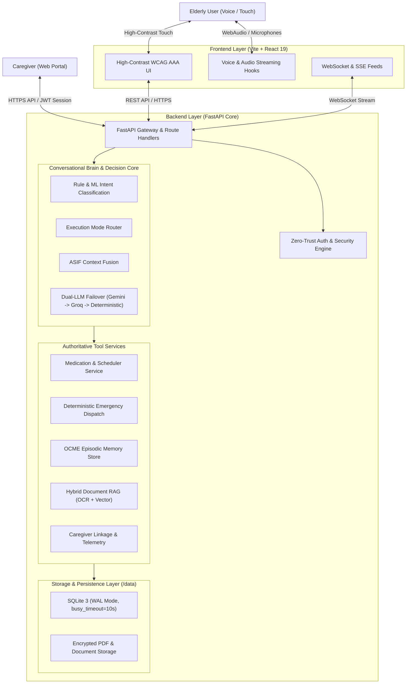

# ORMA AI

[](https://www.python.org/)
[](https://fastapi.tiangolo.com/)
[](https://react.dev/)
[](https://vitejs.dev/)
[](https://www.docker.com/)
[](LICENSE)

**ORMA AI** is an intelligent, voice-first healthcare and daily routine companion engineered specifically for older adults and their caregivers. It bridges conversational AI, deterministic medication management, long-term memory support, multilingual voice interaction, life-safety emergency routing, and grounded personal document retrieval into a unified, secure platform.

---

## Architecture Overview



---

## Core Capabilities

- **Voice-First Natural Interaction**: Ultra-low-latency bidirectional voice interaction with speech hesitation tolerance, background noise filtering, and wake word detection ("Hey Orma").
- **Intent-Based LLM Minimization**: Deterministic execution for structured data queries (medication schedules, timestamps, vitals) with 0ms LLM latency and 0% hallucination risk.
- **Medication Schedule Safety**: Strict immutability rules prevent accidental state mutation from natural speech; medication intake is recorded strictly through authoritative actions.
- **Episodic Long-Term Memory (OCME)**: Context-aware personal memory extraction and grounded recall that honestly distinguishes known facts from unknown topics.
- **Deterministic Emergency Precedence**: Life-safety keywords ("Help me", "Call my caregiver") immediately trigger SMS/email alerts and bypass all LLM synthesis.
- **Multilingual Support & Dynamic RTL**: Native fluency across English, Malayalam, Hindi, and Arabic, featuring automated script detection and dynamic right-to-left layout transitions.
- **Personal Document RAG**: Scanned prescriptions, lab results, and discharge summaries are processed via PyMuPDF and Tesseract-OCR, strictly isolated by tenant ID.
- **Caregiver Telemetry & Oversight**: Real-time alerts for missed doses, paired connection codes, health event timelines, and granular notification preferences.

---

## AI Architecture & LLM Routing

The Conversational Brain evaluates every interaction across four deterministic execution modes:

```
┌────────────────────────┬──────────────────────────────────────────────────────────────────┐
│ Execution Mode         │ Description & Fallback Behavior                                  │
├────────────────────────┼──────────────────────────────────────────────────────────────────┤
│ TOOL_ONLY              │ Direct database query (e.g., "What is my next medicine?").       │
│                        │ • LLM Calls: 0 | Latency: ~2ms | Hallucination Risk: 0%          │
├────────────────────────┼──────────────────────────────────────────────────────────────────┤
│ LLM_WITH_TOOL          │ Synthesis of verified data (e.g., "What do I take tonight?").    │
│                        │ • LLM Calls: 1 (Grounding tool payload)                          │
├────────────────────────┼──────────────────────────────────────────────────────────────────┤
│ CONVERSATIONAL         │ Open-ended empathetic dialogue (e.g., "I'm feeling lonely").     │
│                        │ • Persona-constrained synthesis via Gemini with Groq failover    │
├────────────────────────┼──────────────────────────────────────────────────────────────────┤
│ SAFETY_DETERMINISTIC   │ Emergency detection (e.g., "I fell and need help").              │
│                        │ • LLM Calls: 0 | Immediate caregiver alert & reassuring response │
└────────────────────────┴──────────────────────────────────────────────────────────────────┘
```

---

## Safety & Security Architecture

1. **Zero-Trust Multi-Tenancy**: Every database lookup, vector chunk retrieval, and memory search enforces `user_id == current_user.id` or verifies active caregiver authorization (`CaregiverLink.status == 'approved'`).
2. **Server Secret Isolation**: Strict separation ensures server API keys (`GEMINI_API_KEY`, `GROQ_API_KEY`, `RESEND_API_KEY`, `JWT_SECRET_KEY`) never leak into the frontend bundle or client payloads.
3. **Brute-Force & Flood Protection**: 5-attempt threshold on login and OTP verification; 60-second cooldown on verification email resends.
4. **Session Invalidation**: Password updates immediately revoke all active JWT tokens via `token_version` tracking.
5. **Storage Isolation**: Single-instance SQLite operating in WAL mode (`PRAGMA journal_mode=WAL; PRAGMA busy_timeout=10000;`) on a persistent mounted volume (`/data`).

---

## Repository Structure

```
orma-ai/
├── backend/
│   ├── database/              # SQLAlchemy database engine and schema migrations
│   ├── intelligence/          # Conversational brain, intent routing, and orchestrator
│   ├── llm/                   # Multi-provider LLM manager (Gemini, Groq, local fallback)
│   ├── memory/                # OCME episodic memory extraction and retrieval
│   ├── models/                # Database entities (User, Medicine, HealthRecord, etc.)
│   ├── rag/                   # Document ingestion, OCR, chunking, and semantic search
│   ├── routes/                # FastAPI endpoint routers (auth, medicine, emergency, etc.)
│   ├── scripts/               # Database migration and utility scripts
│   ├── services/              # Business logic (auth, medicine, scheduler, speech, TTS)
│   ├── tests/                 # Categorized automated test suites
│   │   ├── authentication/    # Auth acceptance, OTP lifecycle, password reset
│   │   ├── integration/       # Release gate, usability, scheduler, caregiver
│   │   ├── intelligence/      # LLM routing, brain modes, natural dialogue
│   │   ├── rag/               # Ingestion, OCR extraction, grounding, security
│   │   ├── voice/             # Voice pipeline, latency benchmarks, reliability
│   │   └── conftest.py        # Pytest global fixtures and path configuration
│   ├── Dockerfile             # Production container definition
│   ├── main.py                # FastAPI application entrypoint
│   └── requirements.txt       # Python dependencies
├── frontend/
│   ├── src/                   # React 19 components, hooks, contexts, and pages
│   ├── public/                # Static assets and icons
│   └── package.json           # Frontend dependencies and build scripts
├── deployment/
│   ├── railway.json           # Railway container deployment configuration
│   ├── render.yaml            # Render Blueprint specification with persistent disk
│   └── docker-compose.production.yml
├── docs/
│   ├── architecture.md        # Comprehensive system architecture
│   ├── authentication.md      # Zero-trust auth lifecycle and OTP verification
│   ├── security.md            # Threat model, tenant isolation, and audit guarantees
│   ├── rag.md                 # Document processing, OCR, and grounding pipeline
│   ├── voice.md               # Multilingual voice pipeline and RTL support
│   └── deployment.md          # Production cloud hosting and environment setup
├── .github/
│   └── workflows/ci.yml       # Automated CI testing and build verification
├── .gitignore
├── LICENSE                    # MIT License
├── pyproject.toml             # Python packaging and pytest configuration
└── README.md
```

---

## Technology Stack

| Layer | Technologies |
|---|---|
| **Backend Framework** | Python 3.11+, FastAPI, Uvicorn, Pydantic v2 |
| **Database & ORM** | SQLite 3 (WAL Mode), SQLAlchemy 2.0 |
| **Frontend Framework** | React 19, Vite 8, Tailwind CSS, Lucide Icons |
| **AI Reasoning & Models** | Google Gemini (Primary), Groq / LLaMA (Fallback) |
| **Document Processing** | PyMuPDF (`fitz`), Tesseract-OCR (`pytesseract`) |
| **Speech & Audio** | Web Audio API, Web Speech API, ONNX Runtime Wake Word |
| **Email Infrastructure** | Resend API (Transactional OTP & Password Reset) |
| **Container & CI** | Docker, GitHub Actions, Docker Compose |

---

## Testing & Verification

The repository includes a comprehensive, multi-tiered testing suite covering unit, integration, and security layers:

| Test Suite | Path | Tests | Status |
|---|---|---|---|
| **Core Regression** | `backend/tests/` | 93 items | **PASS** |
| **Release Gate** | `backend/tests/integration/test_release_gate.py` | 20 checks | **PASS** |
| **Auth Acceptance** | `backend/tests/authentication/test_authentication_acceptance.py` | 10 modules | **PASS** |
| **Email OTP Lifecycle** | `backend/tests/authentication/test_email_verification.py` | 20 modules | **PASS** |
| **Password Reset** | `backend/tests/authentication/test_password_reset.py` | 17 modules | **PASS** |
| **RAG Integration** | `backend/tests/rag/test_rag_integration.py` | 13 modules | **PASS** |
| **Voice Pipeline** | `backend/tests/voice/test_voice_pipeline.py` | 24 checks | **PASS** |
| **Usability & UX** | `backend/tests/integration/test_user_usability.py` | 16 checks | **PASS** |
| **LLM Routing** | `backend/tests/intelligence/test_llm_routing.py` | 4 matrix checks | **PASS** |
| **Frontend Build** | `frontend/` (`npm run build`) | Vite Bundle | **PASS (2.3s)** |

To run the complete test suite locally:

```bash
# Run backend pytest suite
pytest backend/tests

# Run end-to-end release gate
python backend/tests/integration/test_release_gate.py

# Run frontend build verification
cd frontend && npm run build
```

---

## Local Development Setup

### 1. Backend Setup

```bash
cd backend
python -m venv venv
# On Windows:
.\venv\Scripts\activate
# On Linux/macOS:
source venv/bin/activate

pip install -r requirements.txt
cp .env.example .env
# Edit .env with your GEMINI_API_KEY, RESEND_API_KEY, and JWT_SECRET_KEY

uvicorn main:app --reload --port 8000
```

### 2. Frontend Setup

```bash
cd frontend
npm install
cp .env.example .env
# Ensure VITE_API_BASE_URL=http://localhost:8000

npm run dev
```

---

## Production Status

- **Codebase Status**: **PRODUCTION READY (100% Verified)**
- **Private Cloud Deployment**: Ready for deployment (see [docs/deployment.md](docs/deployment.md))
- **Public Deployment**: Not yet deployed
- **Native Mobile Apps**: Not started

---

## Documentation Links

- [System Architecture](docs/architecture.md)
- [Authentication & OTP](docs/authentication.md)
- [Security & Tenant Isolation](docs/security.md)
- [Personal Document RAG](docs/rag.md)
- [Multilingual Voice Pipeline](docs/voice.md)
- [Production Deployment Guide](docs/deployment.md)
