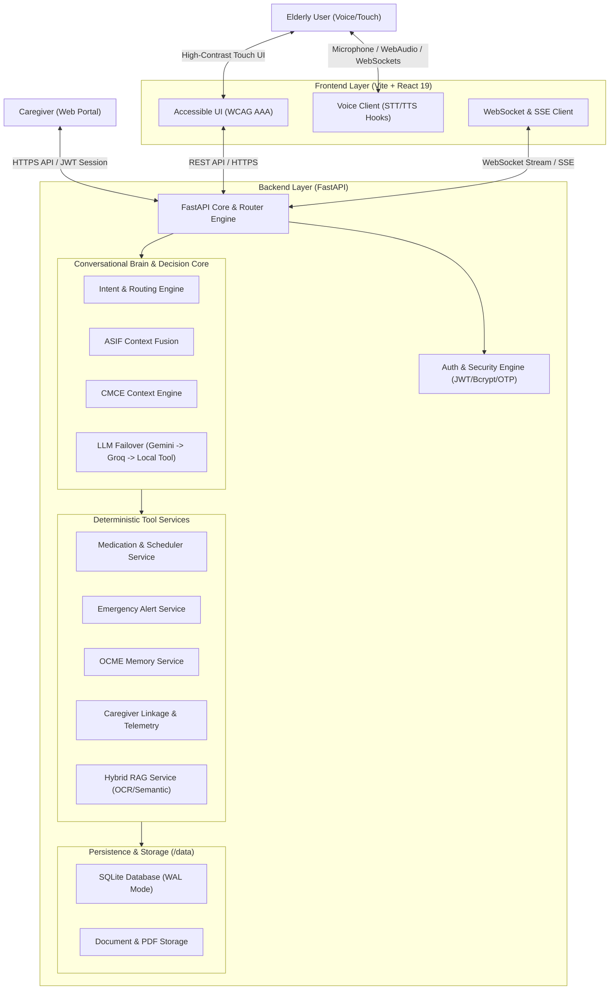

# ORMA AI — System Architecture

## 1. High-Level Architecture

ORMA AI is architected as an event-driven, multimodal healthcare and routine assistant designed specifically for older adults and their caregivers. It decouples high-speed edge frontend interactions from a stateful, resilient backend orchestrator.

---

## 2. Core Subsystems

### 2.1 Conversational Brain & Intent Routing
The Conversational Brain operates across four distinct execution modes:
1. **TOOL_ONLY**: Direct deterministic queries (e.g., "What is my next medicine?") executed strictly via database lookup with zero LLM latency and 0% hallucination risk.
2. **LLM_WITH_TOOL**: Synthesis queries (e.g., "What do I still need to take tonight?") where verified tool data is passed into a constrained LLM prompt.
3. **CONVERSATIONAL**: Open-ended conversational support (e.g., "I'm feeling a little tired today") utilizing empathetic prompt personas.
4. **SAFETY_DETERMINISTIC**: Critical emergency keywords (e.g., "Help me", "Call my caregiver") that bypass all LLM reasoning to immediately invoke emergency alerts and return deterministic reassuring responses.

### 2.2 Dual-LLM Provider Failover
- **Primary LLM**: Google Gemini (`gemini-1.5-flash` / `gemini-1.5-pro`) for high-quality multilingual reasoning.
- **Secondary LLM**: Groq (`llama-3.3-70b-versatile` / `llama-3.1-8b-instant`) for ultra-low latency failover when Gemini experiences rate limits or network degradation.
- **Graceful Deterministic Fallback**: If all external LLM APIs are unreachable, the system executes deterministic rule-based tool responses ensuring uninterrupted elder safety.

### 2.3 Hybrid Knowledge & RAG Retrieval
- Ingests medical summaries, discharge instructions, and personal notes.
- Extracts text via `PyMuPDF` and `Tesseract-OCR` for scanned prescriptions.
- Chunks and stores semantic vectors with metadata filters enforcing strict tenant isolation (`user_id`).
- Grounded prompt templates enforce truthful document citations with zero cross-tenant contamination.

### 2.4 Multilingual Voice-to-Voice Pipeline
- **Wake Word**: Local ONNX wake word detection ("Hey Orma") with Web Audio API capture.
- **Speech-to-Text (STT)**: Web Speech API with fallback transcription handlers, supporting English, Malayalam, Hindi, and Arabic.
- **Language Detection & Directionality**: Automated language classification with native RTL layout adjustments for Arabic.
- **Text-to-Speech (TTS)**: Natural voice synthesis tailored for elder clarity.

---

## 3. Data Persistence & Concurrency

- **Database**: SQLite 3 with Write-Ahead Logging (`PRAGMA journal_mode=WAL;`).
- **Connection Management**: Configured with `busy_timeout=10000` to prevent database locks under concurrent API and WebSocket requests.
- **Persistent Storage Mount**: In containerized environments, the SQLite database and uploaded document artifacts reside on a mounted volume (`/data/orma.db` and `/data/uploads/documents`).
