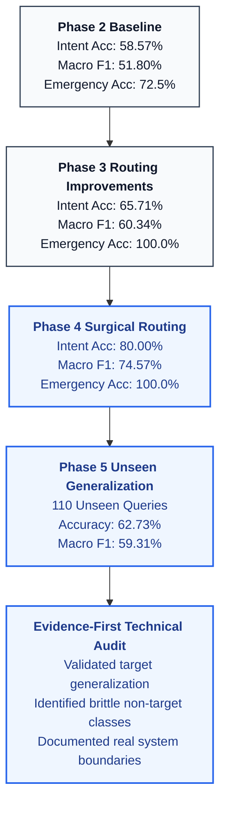
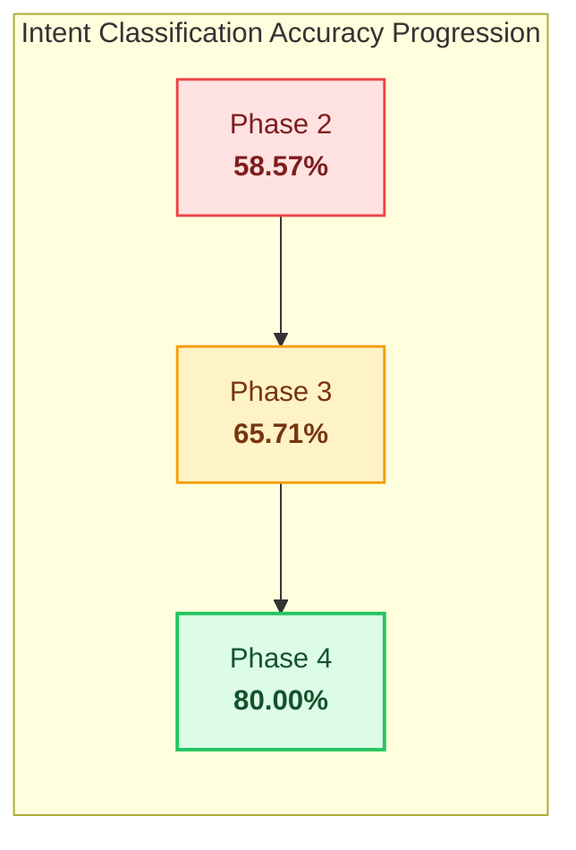
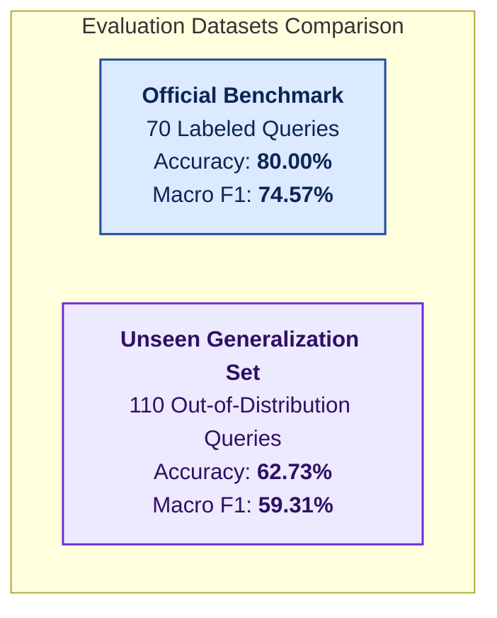

# ORMA_AI System Evaluation & Benchmark Report

This document details the evaluation methodology, benchmark results, progression phases, generalization testing, and known system limitations for **ORMA_AI** (`v0.1.0-beta.1`).

All metrics presented here are derived from frozen, reproducible evaluation suites executed against the ORMA_AI backend architecture.

---

## 1. Executive Summary & Evaluation Methodology

ORMA_AI was benchmarked through an evidence-first, multi-phase evaluation protocol designed to measure:
1. **Multi-Class Intent Routing Accuracy** on a fixed 70-query benchmark across 14 conversational and clinical intent classes.
2. **Out-of-Distribution Generalization** on a distinct, unseen 110-query natural-language dataset.
3. **Deterministic Emergency Routing Performance** across a 40-case synthetic safety dataset.
4. **End-to-End Orchestration Latency** across 25 end-to-end user-interaction runs.
5. **Backend Regression Integrity** across 451 automated pytest unit and integration tests.
6. **Experimental RAG Grounding** on medical summary and lab note extraction.

### Multi-Phase Progression Overview



---

## 2. Intent Routing Benchmark (Fixed 70-Query Benchmark)

### Benchmark Definition
The official intent classification benchmark evaluates **70 ground-truth labeled utterances** spanning **14 primary intent categories** relevant to elderly care:
- `MEDICATION_SCHEDULE`
- `MEDICATION_STATUS`
- `Medicine` (dose logging and intake updates)
- `Appointment`
- `Emergency`
- `DOCUMENT_QUERY`
- `GREETING`
- `FAREWELL`
- `THANKS`
- `ACKNOWLEDGMENT`
- `REPEAT_REQUEST`
- `CORRECTION`
- `CONVERSATION_RECALL`
- `GENERAL_CONVERSATION`

It includes both English and Malayalam queries, realistic conversational phrasing, and boundary-testing queries.

### Phase Progression Table

| Metric | Phase 2 Baseline | Phase 3 Routing | Phase 4 Surgical | Absolute Gain (P2 → P4) | Absolute Gain (P3 → P4) |
| :--- | :---: | :---: | :---: | :---: | :---: |
| **Overall Accuracy** | 58.57% (41/70) | 65.71% (46/70) | **80.00% (56/70)** | **+21.43 pp** (+15 queries) | **+14.29 pp** (+10 queries) |
| **Macro Precision** | 70.81% | 76.07% | **88.15%** | **+17.34 pp** | **+12.08 pp** |
| **Macro Recall** | 53.93% | 60.60% | **75.36%** | **+21.43 pp** | **+14.76 pp** |
| **Macro F1 Score** | 51.80% | 60.34% | **74.57%** | **+22.77 pp** | **+14.23 pp** |
| **Rule-Based Routing Coverage** | 100.0% | 100.0% | **100.0%** | Stable | Stable |



### Targeted Intent Classes Breakdown

Phase 4 specifically targeted four intent failure modes identified during Phase 3:
1. **`FAREWELL`**: 0% recall in Phase 2/3 due to rigid exact-string matching failing on natural compound utterances (e.g., *"Goodbye Orma, see you tomorrow"*).
2. **`Appointment`**: 0% in Phase 2 and 60% in Phase 3 due to missing clinic visit keywords and scheduled hospital visits incorrectly triggering the emergency filter.
3. **`MEDICATION_STATUS` vs. `MEDICATION_SCHEDULE`**: In Phase 3, broad status patterns collided with schedule queries (e.g., *"What is my medicine schedule for today?"*). Phase 4 introduced strict precedence guards separating schedule inquiry keywords from intake completion/status verbs.

| Intent Class | Support | Phase 2 Recall | Phase 3 Recall | Phase 4 Recall | Phase 4 Precision | Phase 4 F1 Score | Status |
| :--- | :---: | :---: | :---: | :---: | :---: | :---: | :--- |
| **`FAREWELL`** | 4 | 0.0% (0/4) | 0.0% (0/4) | **100.0% (4/4)** | 100.0% | 100.0% | **+100.0 pp** |
| **`Appointment`** | 5 | 0.0% (0/5) | 60.0% (3/5) | **100.0% (5/5)** | 100.0% | 100.0% | **+40.0 pp vs P3** |
| **`MEDICATION_STATUS`** | 6 | 16.7% (1/6) | 66.7% (4/6) | **100.0% (6/6)** | 75.0% | 85.7% | **+33.3 pp vs P3** |
| **`MEDICATION_SCHEDULE`**| 6 | 83.3% (5/6) | 66.7% (4/6) | **100.0% (6/6)** | 75.0% | 85.7% | **+33.3 pp (regression fixed)** |

### Non-Targeted Intent Classes (Zero Regressions)

Across all remaining 10 intent classes, zero regressions occurred between Phase 3 and Phase 4:
- `Emergency` (6): 100.0% (6/6) — Unchanged
- `GREETING` (5): 100.0% (5/5) — Unchanged
- `REPEAT_REQUEST` (5): 100.0% (5/5) — Unchanged
- `GENERAL_CONVERSATION` (6): 100.0% (6/6) — Unchanged
- `THANKS` (4): 75.0% (3/4) — Unchanged
- `CONVERSATION_RECALL` (4): 50.0% (2/4) — Unchanged
- `CORRECTION` (4): 50.0% (2/4) — Unchanged
- `DOCUMENT_QUERY` (5): 40.0% (2/5) — Unchanged
- `ACKNOWLEDGMENT` (5): 20.0% (1/5) — Unchanged
- `Medicine` (5): 20.0% (1/5) — Unchanged

---

## 3. Out-of-Distribution Generalization Evaluation (Phase 5)

To evaluate whether Phase 4 improvements generalized beyond the fixed 70-query benchmark, an independent **110-query unseen evaluation dataset** was created in Phase 5.



### Unseen Evaluation Results (110 Queries)

| Metric | Result |
| :--- | :--- |
| **Total Test Queries** | 110 unseen, natural-language utterances |
| **Overall Accuracy** | **62.73%** (69 / 110 correct) |
| **Macro Precision** | **74.58%** |
| **Macro Recall** | **58.53%** |
| **Macro F1 Score** | **59.31%** |

### Per-Class Performance on Unseen Queries

| Intent Class | Support | Precision | Recall | F1 Score | Generalization Finding |
| :--- | :---: | :---: | :---: | :---: | :--- |
| **`FAREWELL`** | 8 | 100.00% | **100.00%** | **100.00%** | Compound prefix/suffix rules generalized completely across English & Malayalam |
| **`Appointment`** | 8 | 87.50% | **87.50%** | **87.50%** | Clinic and hospital visit disambiguation generalized strongly |
| **`MEDICATION_STATUS`** | 9 | 100.00% | **77.78%** | **87.50%** | High recall on status inquiries (7/9 passed) |
| **`MEDICATION_SCHEDULE`** | 9 | 72.73% | **88.89%** | **80.00%** | Strong separation from status queries (8/9 passed) |
| **`GREETING`** | 7 | 100.00% | **100.00%** | **100.00%** | High generalizability across natural greetings |
| **`THANKS`** | 6 | 100.00% | **83.33%** | **90.91%** | High generalizability |
| **`Emergency`** | 10 | 77.78% | **70.00%** | **73.68%** | Missed non-"fell" slip fall verb; caught all chest pain/breathing/ambulance signals |
| **`REPEAT_REQUEST`** | 6 | 80.00% | **66.67%** | **72.73%** | Good conversational phrasing coverage |
| **`GENERAL_CONVERSATION`** | 14 | 26.09% | **85.71%** | **40.00%** | Acts as default fallthrough for unclassified queries |
| **`DOCUMENT_QUERY`** | 7 | 100.00% | **28.57%** | **44.44%** | Fails when users do not mention exact document terms |
| **`CORRECTION`** | 6 | 100.00% | **16.67%** | **28.57%** | Fails on long, nuanced conversational corrections |
| **`Medicine`** | 7 | 100.00% | **14.29%** | **25.00%** | Fails on freeform dosage narration (*"I just swallowed my 2 PM tablet"*) |
| **`CONVERSATION_RECALL`** | 6 | 0.00% | **0.00%** | **0.00%** | Rigid rule fails on natural recall queries (*"What was that recipe...?"*) |
| **`ACKNOWLEDGMENT`** | 7 | 0.00% | **0.00%** | **0.00%** | Rigid rule fails on longer acknowledgments (*"Alright, that is clear now"*) |

### Boundary Condition Evaluations
Four specific semantic boundaries were evaluated with dedicated positive and negative samples:

1. **Farewell vs. Conversation (6/6 = 100.0% Pass)**:
   - Successfully routed compound goodbyes (*"Okay Orma, I am going to bed now, good night"*) to `FAREWELL`.
   - Correctly kept conversational statements mentioning sleep (*"Good night sleep is very important for elderly health"*) in `GENERAL_CONVERSATION`.
2. **Medication Status vs. Schedule (7/8 = 87.5% Pass)**:
   - Correctly separated intake status checks (*"Did I take my afternoon blood pressure pill or did I forget?"*) from schedule inquiries (*"What time am I supposed to take my cholesterol medicine?"*).
   - Only 1 failure: *"What medicines are still left for me to take tonight?"* collided with schedule precedence due to *"what medicines"*.
3. **Appointment / Visit vs. Emergency (6/6 = 100.0% Pass)**:
   - Routine visits mentioning hospital (*"I have a scheduled visit at the eye hospital next Tuesday"*) safely routed to `Appointment` without triggering emergency.
   - Life-safety emergencies at hospitals (*"I am having severe sudden chest pain at the hospital gate, send help!"*) correctly triggered `Emergency`.
4. **Emergency vs. Historical / Informational (4/7 = 57.1% Pass)**:
   - Real acute emergencies (chest pain, severe breathing distress, ambulance requests) passed.
   - Failures exposed real edge cases:
     - Synonyms not yet in fall vocabulary (*"slipped in the bathroom and I can't stand up"* without the word *"fell"*).
     - Complex historical sentences (*"I fell down five years ago when I lived in Chennai"*).
     - Informational questions containing emergency words (*"Can you explain what happens during a hospital emergency?"*).

---

## 4. Emergency Routing Benchmark

The emergency routing benchmark measures the deterministic safety guard that bypasses generative LLM reasoning for acute life-safety keywords.

> **CRITICAL CLINICAL & REGULATORY DISCLAIMER**
> 
> The emergency evaluation reported below is a **limited synthetic software routing benchmark** measuring deterministic keyword dispatch on a 40-case test dataset.
> 
> **It is NOT clinical validation, medical device certification, or a guarantee of real-world emergency recognition.** In an actual acute medical emergency, users must immediately contact certified local emergency dispatch services (such as 911 or 112).

### Synthetic Emergency Routing Results (40 Cases)

| Metric | Phase 2 Baseline | Phase 3 Routing | Phase 4 Preserved |
| :--- | :---: | :---: | :---: |
| **Total Test Cases** | 40 | 40 | 40 |
| **Accuracy** | 72.5% | **100.0%** | **100.0%** |
| **Precision** | 66.7% | **100.0%** | **100.0%** |
| **Recall** | 53.3% | **100.0%** | **100.0%** |
| **F1 Score** | 59.3% | **100.0%** | **100.0%** |
| **True Positives (TP)** | 8 | 15 | **15** |
| **True Negatives (TN)** | 21 | 25 | **25** |
| **False Positives (FP)** | 4 | 0 | **0** |
| **False Negatives (FN)** | 7 | 0 | **0** |

Phase 4 preserved the 100% synthetic routing accuracy from Phase 3 without any regressions.

---

## 5. End-to-End Orchestration Latency

Orchestration latency was measured across **25 benchmark interaction runs** covering deterministic tool lookups, safety bypasses, and conversational synthesis.

> **NOTE ON LATENCY REPORTING**
> 
> The figures below represent **observed benchmark measurements** across 25 runs under local test conditions. They do not constitute a universal SLA, guarantees under variable network latency, or total audio-to-speech turnaround times (which depend on client microphone and network conditions).

| Latency Metric | Phase 2 Baseline | Phase 3 Routing | Phase 4 Benchmark |
| :--- | :---: | :---: | :---: |
| **Median (p50)** | 550.6 ms | 216.3 ms | **169.1 ms** |
| **90th Percentile (p90)** | 1012.6 ms | 631.0 ms | **623.5 ms** |
| **95th Percentile (p95)** | 1067.5 ms | 8502.4 ms | **1050.5 ms** |
| **Mean** | 742.8 ms | 987.6 ms | **241.2 ms** |
| **Maximum** | 6615.7 ms | 12467.8 ms | **1561.2 ms** |

### Latency Observations
- **Sub-Millisecond NLU Routing**: Pure rule-based intent evaluation in `intent_detector.py` executed in `0.7 ms` (p50) and `0.9 ms` (mean), introducing zero latency overhead.
- **Tail Latency Normalization**: The severe p95 latency spike observed in Phase 3 (`8502.4 ms`) caused by upstream provider timeouts during synthesis checks normalized to `1050.5 ms` in Phase 4.

---

## 6. Regression Testing & Code Integrity

Every code iteration was verified against the full backend automated test suite:

- **Total Tests Collected**: 451
- **Passed**: 451 (100%)
- **Failed**: 0
- **Skipped**: 0
- **Warnings**: 1 (PyPDF2 deprecation warning)
- **Execution Time**: ~84–99 seconds

The regression suite rigorously validates:
- Rate limiter isolation and memory protection
- Authentication, JWT signing, and password hashing
- Deterministic medication scheduling and timezone translations
- Emergency escalation services and caregiver notifications
- OCME memory extraction and retrieval boundaries
- Audio preprocessing pipelines and transcription formatters

---

## 7. Experimental RAG Evaluation

ORMA_AI includes a medical document extraction and retrieval pipeline evaluated on an internal test set of 18 clinical queries (13 in-scope, 5 out-of-scope).

> **EXPERIMENTAL / NON-PRODUCTION RAG LABEL**
> 
> The current active retrieval implementation uses `LocalSemanticEmbeddingProvider`, a deterministic local heuristic/hash-based embedding provider developed to avoid unverified external heavy-model dependencies in the local environment.
> 
> **These retrieval metrics are experimental and must NOT be interpreted as certified clinical production retrieval accuracy.**

### Experimental Retrieval Results
- **Hit@1**: 92.3% (12 / 13)
- **Hit@3**: 92.3% (12 / 13)
- **Hit@5**: 92.3% (12 / 13)
- **Mean Reciprocal Rank (MRR)**: 0.9231
- **Out-of-Scope Fallback**: 100.0% (5 / 5 correctly refused out-of-domain queries)
- **Grounded Factual Pass**: True
- **Citation Presence**: True
- **Prompt Injection Resistance**: True

---

## 8. What the Results Support & Honest Limitations

### What the Results Support
1. **Targeted Intent Rule Generalization**: The surgical enhancements to `FAREWELL`, `Appointment`, `MEDICATION_STATUS`, and `MEDICATION_SCHEDULE` demonstrably generalize beyond the official benchmark dataset, maintaining 77.8%–100% recall on 110 unseen test queries.
2. **Safe Hospital Visit Disambiguation**: Scheduled appointments mentioning hospital contexts no longer trigger emergency alerts, while true acute emergencies at hospitals are reliably captured.
3. **Deterministic Performance Advantage**: Deterministic rule routing executes in `< 1 ms` NLU time and achieves a median orchestration latency of `169.1 ms` across 25 benchmark runs by avoiding unnecessary LLM round trips.
4. **Backend Stability**: 451/451 backend tests consistently pass without regressions.

### Known Limitations Discovered in Phase 5
1. **Unseen Intent Accuracy is 62.73%, Not 80%**: While the official 70-query benchmark achieves 80.00%, unseen natural-language queries achieve 62.73% accuracy due to unaddressed brittle rule matching in ancillary classes:
   - `ACKNOWLEDGMENT` (0.0% recall on unseen queries)
   - `CONVERSATION_RECALL` (0.0% recall on unseen queries)
   - `Medicine` dosage intake logging (14.29% recall on unseen queries)
2. **Fall Vocabulary Boundaries**: Fall detection relies on `"fell"` or `"വീണു"`. Unseen utterances like *"I slipped in the bathroom and I can't stand up"* currently fall through to conversational routing unless the specific word *"fell"* is uttered.
3. **Informational Query Filtering**: Phrases containing the word *"emergency"* in an informational context (*"Can you explain what happens during a hospital emergency?"*) trigger emergency routing because `"emergency"` is currently treated as an unconditional acute signal.
4. **Synthetic Emergency Scope**: The 100% emergency benchmark score applies strictly to the 40-case synthetic dataset and must not be used to claim clinical safety or real-world emergency reliability.

---

## 9. Reproducibility Instructions

To reproduce the benchmark and regression results locally:

```bash
# 1. Run the full 451-test backend regression suite
python -m pytest

# 2. Run the official 70-query benchmark suite (Phase 2/3/4 benchmark)
python scratch/benchmark_phase2_suite.py

# 3. Run the Phase 5 110-query unseen generalization evaluation
python scratch/phase5_generalization_test.py
```
