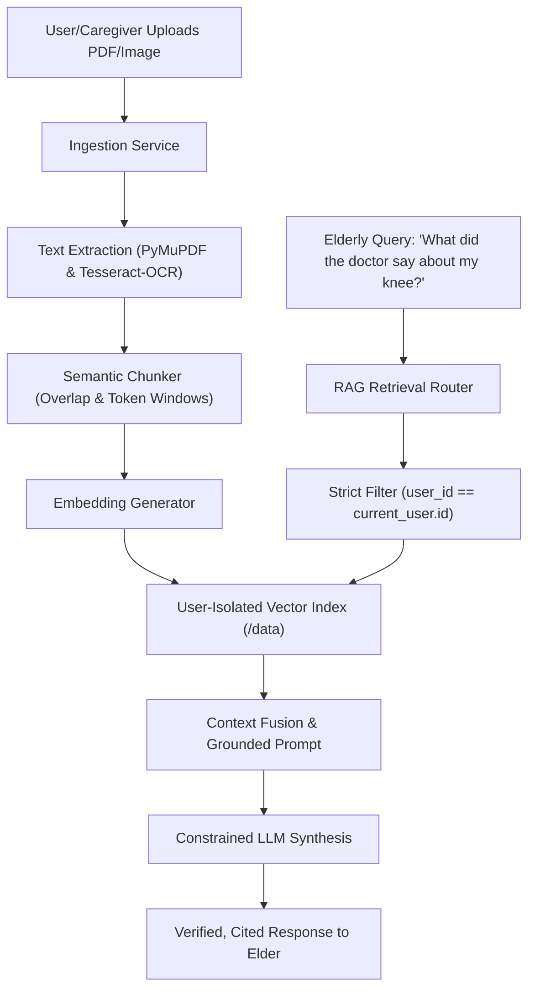

# ORMA AI — Personal Document RAG Architecture

## 1. Overview

The Personal Document RAG (Retrieval-Augmented Generation) pipeline empowers elders to ask natural questions about their personal medical summaries, discharge instructions, lab tests, and doctor notes without risk of hallucination or cross-tenant data leakage.

---

## 2. Ingestion Pipeline

1. **Document Validation**:
   - File size limits (max 10MB).
   - Allowed formats: PDF, PNG, JPG, JPEG, TXT.
2. **Text Extraction**:
   - Native digital PDFs parsed using `PyMuPDF` (`fitz`).
   - Scanned prescription images and non-selectable PDFs parsed using `pytesseract` (Tesseract-OCR).
3. **Chunking & Metadata**:
   - Dynamic chunk sizes (500 tokens with 50-token overlap).
   - Metadata tagging: `doc_id`, `user_id`, `filename`, `page_number`, `timestamp`.

---

## 3. Grounded Synthesis & Anti-Hallucination

- **Context Grounding**: The LLM prompt strictly instructs: *"Only answer based on the provided document excerpts. If the information is not present in the documents, explicitly state that you cannot find it."*
- **Source Citation**: Returned responses include references to the document name and page number for caregiver verification.
