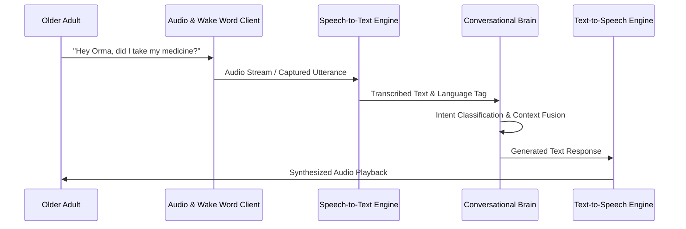

# ORMA AI — Multilingual Voice Architecture

## 1. Overview

ORMA AI provides a voice-first interface tailored for older adults who may experience visual impairment, motor limitations, or digital literacy barriers.

---

## 2. Voice Pipeline Flow

---

## 3. Multilingual Support & RTL

- **Supported Languages**: English (`en-IN` / `en-US`), Malayalam (`ml-IN`), Hindi (`hi-IN`), Arabic (`ar-SA`).
- **Automated Language Detection**: Classifies spoken language dynamically from the input stream.
- **RTL Support**: When Arabic is detected or selected, frontend typography and directionality dynamically adapt to right-to-left.
- **Noise & Stutter Tolerance**: Built-in regex and phonetic matching handles speech fragments, hesitation, background noise, and colloquial phrasing.
